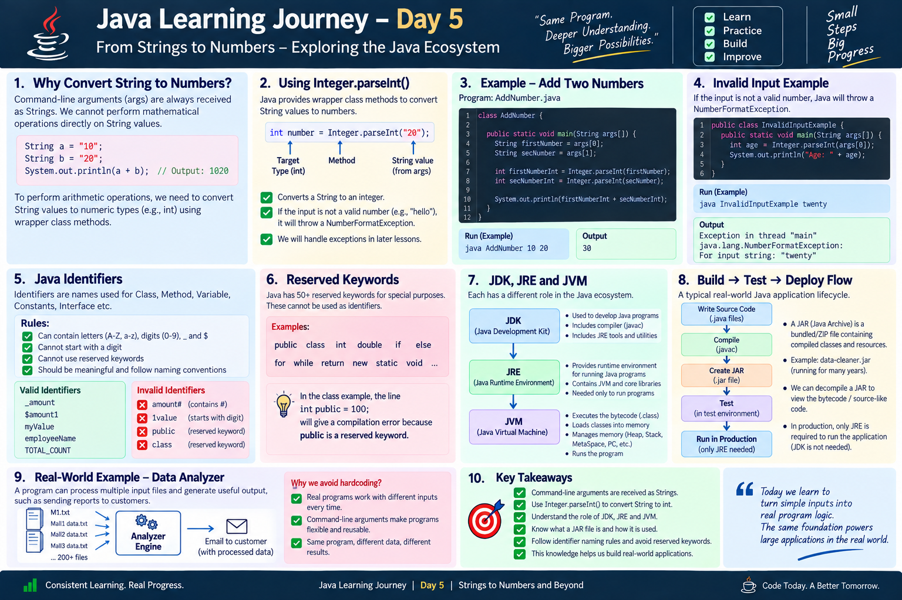

# Day 5 — From String Input to Numbers

## Overview

Day 5 continued the command-line argument concept from Day 4.

The key question was:

> **If command-line arguments arrive as Strings, how can we use them for mathematical operations?**

Today's practical exercise answered that question by introducing `Integer.parseInt()` and then connected the idea to Java's runtime ecosystem, JAR files, decompilation, and Java identifiers.

---

## 1. The Starting Point — Command-Line Arguments

From Day 4, we learned that command-line arguments are received through:

```java
public static void main(String args[])
```

The values in `args` are Strings.

For example:

```bash
java AddNumber 20 30
```

The program receives:

```text
args[0] → "20"
args[1] → "30"
```

Even though `20` and `30` look like numbers, they arrive as **String values**.

---

# 2. Why Do We Need Conversion?

A String containing a number is not the same thing as an integer.

For example:

```java
String firstNumber = "20";
String secondNumber = "30";
```

If we combine Strings using `+`:

```java
System.out.println(firstNumber + secondNumber);
```

the values are treated as text rather than mathematical values.

So the program needs to convert the String values into integers before performing arithmetic.

This is where `Integer.parseInt()` comes in.

---

# 3. `Integer.parseInt()`

`Integer.parseInt()` converts a valid numeric String into an `int`.

The basic flow is:

```text
String
  ↓
Integer.parseInt()
  ↓
int
```

Example:

```java
int number = Integer.parseInt("20");
```

Now `number` contains an integer value.

With command-line arguments:

```java
int firstNumberInt = Integer.parseInt(args[0]);
int secNumberInt = Integer.parseInt(args[1]);
```

The important distinction is:

```text
args[0]
  ↓
String "20"
  ↓
Integer.parseInt()
  ↓
int 20
```

---

# 4. Practical Exercise — Add Two Numbers

Today's main practical exercise was to write a program to add two numbers.


### Classroom Program

```java
class AddNumber
{
    public static void main(String args[])
    {
        String firstNumber = args[0];
        String secNumber = args[1];

        int firstNumberInt = Integer.parseInt(firstNumber);
        int secNumberInt = Integer.parseInt(secNumber);

        System.out.println(firstNumberInt + secNumberInt);
    }
}
```

### Example execution

```bash
javac AddNumber.java
java AddNumber 20 30
```

### Output

```text
50
```

The important learning is the conversion:

```java
Integer.parseInt(firstNumber)
Integer.parseInt(secNumber)
```


---

# 5. What If the Input Is Not a Number?

`Integer.parseInt()` expects a valid integer represented as a String.

For example:

```java
Integer.parseInt("20");
```

works.

But a value such as:

```java
Integer.parseInt("hello");
```

cannot be converted into an integer.

Java reports a:

```text
NumberFormatException
```

The important point for today's lesson is simply to understand **why the conversion can fail**. Exception handling is a separate topic to learn later.

---

# 6. A Small Connection to Java's Existing Classes

The class used `Integer.parseInt()` as an example of something Java already provides.

Instead of writing our own conversion mechanism, we can use a method provided by Java's existing classes.

This introduces an important development habit:

```text
Common programming requirement
            ↓
Check what Java already provides
            ↓
Use the appropriate class/method
```

---

# 7. `java.lang`

The class also discussed commonly used Java classes such as:

```text
String
System
Integer
```

These belong to the `java.lang` package.

`java.lang` is automatically available to Java programs, which is why we can normally use:

```java
String
System
Integer
```

without explicitly importing them.

The class contrasted this with classes from packages such as `java.util`, where an explicit import is normally required.

---

# 8. JDK, JRE and JVM

Day 5 also connected the practical program with the larger Java execution environment.

The rough class notes summarized their roles as:

```text
JDK → Develop Java code and compile it

JRE → Provide the environment for program execution

JVM → Execute the program
```

The relationship can be visualized as:

```text
              JDK
       Development + Compile
               │
               ▼
          Java Program
               │
               ▼
              JRE
       Runtime Environment
               │
               ▼
              JVM
       Executes the program
```

The classroom notes also described a development-to-production flow:

```text
Local Machine
(JDK + JRE)
      ↓
Develop Code
      ↓
Compile
      ↓
Create JAR
      ↓
Testing
      ↓
Production Environment
(JRE)
```


---

# 9. What Is a JAR?

JAR stands for:

> **Java Archive**

The class described a JAR as a bundled/archive format, similar to a ZIP, used to package Java application contents.

Conceptually:

```text
Compiled Classes
      +
Other Required Resources
      ↓
     JAR
      ↓
Bundled Application Package
```


---

# 10. Source Code → JAR → Production

The class presented a simplified application lifecycle:

```text
Source Code
     ↓
   Compile
     ↓
 JAR Created
     ↓
   Tested
     ↓
Running in Production
```

This helped connect the small Java programs being written during learning with how compiled applications can eventually be packaged and deployed.

---

# 11. Decompilation

Another concept introduced today was **decompilation**.

Normally:

```text
Java Source Code
       ↓
    Compile
       ↓
   Bytecode
```

Decompilation works in the opposite direction conceptually:

```text
Bytecode
   ↓
Decompile
   ↓
Java-like / source-like code
```

The class discussed this in the context of a situation where the original source code is unavailable but compiled code still exists.


---

# 12. Java Identifiers

The class then introduced **Java identifiers**.

Identifiers are names given to programming elements such as:

- Classes
- Methods
- Variables
- Constants
- Interfaces

For example:

```java
class AccountInfo
```

`AccountInfo` is an identifier.

And:

```java
String firstNumber;
```

`firstNumber` is an identifier.


---

# 13. Identifier Rules

The class introduced rules for valid identifiers.

### Can contain

Identifiers can contain:

```text
A–Z
a–z
0–9
_
$
```

Examples from the class notes:

```java
_amount
$amount1
myValue
```

### Cannot start with a digit

For example:

```java
1amount
```

is not a valid identifier.

A name such as:

```java
amount1
```

is valid because the digit is not the first character.

### Special characters

Characters such as:

```text
#
```

are not valid in a Java identifier.

For example:

```java
amount#
```

is invalid.

---

# 14. Reserved Keywords

Java has reserved keywords that have special meaning in the language.

Examples include:

```text
public
class
int
static
void
if
else
for
while
return
new
```

These keywords cannot be used as normal identifiers.

The classroom practical file intentionally contains:

```java
int public = 100;
```

This is invalid because `public` is a Java keyword.


---

# 15. Naming Conventions

The class also introduced naming conventions.

Typical examples include:

### Class

```java
class StudentDetails
```

### Variable

```java
studentName
```

### Method

```java
calculateTotal()
```

The goal is to make code easier to read and maintain.

Naming conventions are different from compiler-enforced identifier rules: a convention improves consistency, while a language rule determines whether the identifier is valid.

---

# 16. Connecting Day 4 and Day 5

The progression is now clearer:

### Day 4

```text
Command-Line Input
       ↓
String[] args
       ↓
String values
```

### Day 5

```text
String values
       ↓
Integer.parseInt()
       ↓
int values
       ↓
Arithmetic
```

So Day 5 builds directly on Day 4 instead of introducing an unrelated concept.

---

# 17. Key Takeaways

- Command-line arguments arrive as Strings.
- A String containing digits is still a String.
- `Integer.parseInt()` converts a valid numeric String into an `int`.
- Numeric conversion makes arithmetic operations possible.
- Invalid numeric input can produce `NumberFormatException`.
- Java provides existing classes and methods for common programming tasks.
- `String`, `System`, and `Integer` are examples from `java.lang`.
- JDK is used for Java development and compilation.
- JRE provides the runtime environment.
- JVM executes Java bytecode.
- JAR stands for Java Archive and is used to bundle application contents.
- Java applications can follow a development → compile → package → test → production flow.
- Decompilation can convert compiled bytecode into source-like code.
- Class, method, variable, constant and interface names are identifiers.
- Identifiers must follow Java's naming rules.
- Reserved keywords cannot be used as identifiers.

---

## Visual Note



---

## Today's Classroom Files

```text
Day-05/
├── AddNumber.java
├── AccountInfo.java
├── README.md
└── Exercises/
    └── [self-practice files]
```

The classroom files should be preserved as they were used during the lesson. Additional self-practice should be kept separately under `Exercises/`.

---

## Suggested Self-Practice

Based on today's core practical concept, practice exercises can include:

1. Add Two Numbers
2. Subtract Two Numbers
3. Multiply Two Numbers
4. Calculate the Average of Two Numbers
5. Calculate the Area Using Numeric Arguments
6. Calculate Simple Interest
7. Calculate Total and Difference
8. Compare Two Numeric Values

For these exercises, the key pattern is:

```text
String argument
      ↓
Integer.parseInt()
      ↓
int variable
      ↓
Calculation
```

Keep later concepts such as exception handling, loops, conditions, and more advanced input validation for the days when they are actually introduced.

---

## Learning Log

| Day | Focus | Practical Work |
|---|---|---|
| Day 5 | String → Integer conversion | Add two numbers |
| Day 5 | Java classes | `Integer`, `String`, `System` |
| Day 5 | Runtime ecosystem | JDK, JRE, JVM |
| Day 5 | Packaging | JAR |
| Day 5 | Compiled code | Decompilation concept |
| Day 5 | Java language rules | Identifiers and reserved keywords |

---

## Key Takeaway

> **Day 4 taught me how to receive input. Day 5 taught me how to use that input as a number.**

The small `Integer.parseInt()` exercise connected command-line input with actual program logic and opened the door to understanding how Java's classes, runtime environment, and packaged applications fit together.

**Learn → Practice → Understand → Apply**
