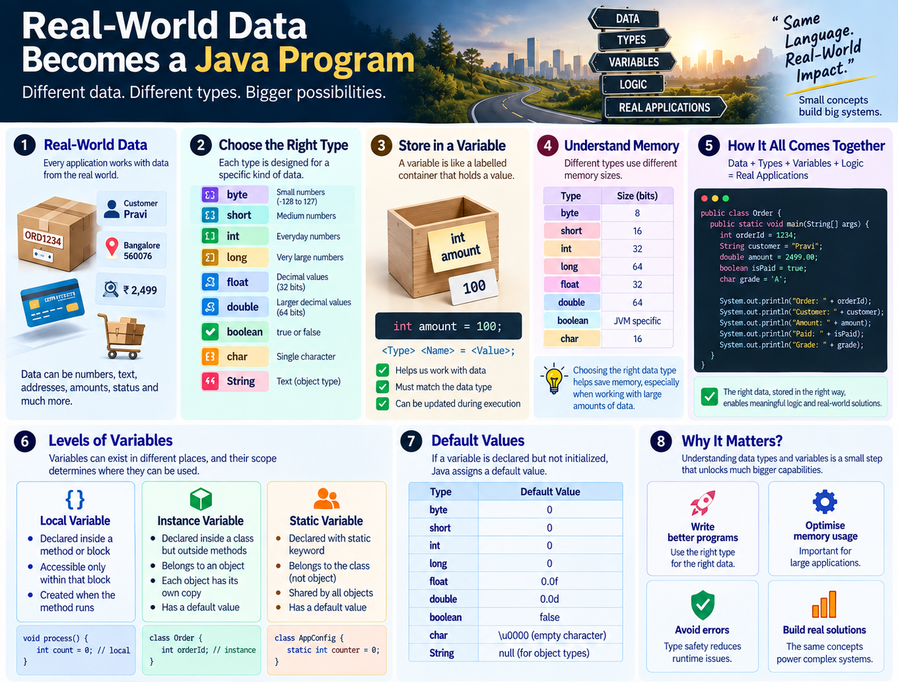

# Day 06–07 — Data Types & Variables

These two sessions connect two important ideas:

> **What kind of data are we storing?** → Data Types  
> **Where does that data belong and how long can we use it?** → Variables

Rather than repeating the same explanation twice, this note combines both sessions into one flow.

---

# 1. Start With the Big Picture

Most applications work with data.

For example, an application may need:

- Order ID
- Address
- PIN code
- Credit-card information
- Amount
- Username
- Account balance
- Status

The basic application flow discussed in the sessions was:

```text
Read Data
   ↓
Process Data
   ↓
Store Data
   ↓
Send Response
```

So, when we write Java programs, we need a way to **represent and work with different kinds of data**.

That is where **data types and variables** come in.

---

# 2. Java Is Strongly Typed

Java is a **strongly typed language**.

That means a variable declaration must specify its type.

```java
int amount = 100;
```

Here:

```text
int     → type
amount  → variable name / identifier
100     → value
=       → assignment operator
```

Java expects the developer to tell it what type of data the variable is going to hold.

Compare the idea with a dynamically typed language such as Python:

```text
Java:
int amount = 100;

Python:
amount = 100
```

The important Java lesson is:

> **When declaring a variable, Java requires its type.**

---

# 3. What Is a Variable?

A variable is a named place used to hold a value.

Think of it as a labelled container:

```text
        amount
     ┌──────────┐
     │   100    │
     └──────────┘
```

Example:

```java
int amount = 100;
```

Later, the value can be changed:

```java
amount = 200;
```

Now:

```text
amount → 200
```

So programming can be viewed at a basic level as:

```text
Data
  +
Logic
  ↓
Processing
```

Variables hold the **data**, while operations and business rules apply the **logic**.

---

# 4. Variable Declaration vs Initialization

A variable can be understood in parts.

### Declaration

```java
int amount;
```

This tells Java:

> Create a variable named `amount` whose type is `int`.

### Initialization

```java
amount = 200;
```

A value is assigned to the variable.

### Declaration + Initialization

```java
int amount = 200;
```

Both are done in one statement.

---

# 5. Assignment vs Comparison

One important distinction from the session:

### Assignment

```java
amount = 200;
```

A single `=` assigns a value.

### Comparison

```java
amount == 200
```

A double `==` is used when comparing two values.

Remember:

```text
=   → assignment
==  → comparison
```

Do not treat `=` as the mathematical "equals" sign when reading Java code.

---

# 6. Two Broad Categories of Data Types

The sessions introduced two broad categories:

```text
Data Types
│
├── Primitive
│
└── Non-Primitive
```

---

# 7. Primitive Data Types

Java has eight primitive data types:

```text
byte
short
int
long
float
double
boolean
char
```

The primitive numeric types can be grouped as:

```text
Integer numbers
    byte
    short
    int
    long

Decimal numbers
    float
    double

Logical value
    boolean

Character
    char
```

---

# 8. Integer Data Types

The sessions introduced the integer types according to their storage size and range.

| Type | Size | Range / Meaning |
|---|---:|---|
| `byte` | 8 bits | -128 to 127 |
| `short` | 16 bits | approximately -32K to 32K |
| `int` | 32 bits | larger integer range |
| `long` | 64 bits | very large integer range |

Example:

```java
byte age = 25;
short amount = 3000;
int population = 1500000;
long distance = 9000000000L;
```

The key idea is:

> **Choose the type according to the data you need to represent.**

---

# 9. Why Does `byte` Have -128 to 127?

A `byte` contains **8 bits**.

Each bit has two possible states:

```text
0 or 1
```

Therefore:

```text
2⁸ = 256 possible combinations
```

For a signed byte, the range is:

```text
-128 to +127
```

That gives:

```text
256 total values
```

The session connected this to powers of 2.

For a signed integer type with `n` bits, the range follows the pattern:

```text
-2^(n-1)  to  2^(n-1)-1
```

For `byte`:

```text
-2⁷ to 2⁷ - 1
-128 to 127
```

---

# 10. Why Use `byte`?

A `byte` is useful when dealing with large quantities of **small numeric values** where memory efficiency matters.

The session used an array example:

```java
int[] values = new int[100000];
```

versus:

```java
byte[] values = new byte[100000];
```

The idea was:

```text
100,000 int values  → more memory
100,000 byte values → less memory
```

So the practical purpose of `byte` becomes clearer when there are **large numbers of small values**, such as data points that are known to stay within the byte range.

For a normal variable used in calculations, using `byte` does not automatically mean the calculation itself becomes more memory-efficient; Java may promote smaller integer types during arithmetic.

---

# 11. `float` and `double`

These types are used for decimal values.

### float

```java
float price = 123.30f;
```

A float uses 32 bits.

The `f` suffix is used to indicate a `float` literal.

### double

```java
double amount = 5432.543d;
```

A double uses 64 bits.

The session introduced `double` as the type providing a larger range/precision than `float`.

```text
float  → 32 bits
double → 64 bits
```

---

# 12. `boolean`

A `boolean` represents a logical state:

```text
true
false
```

Example:

```java
boolean isValid = true;
boolean isAvailable = false;
```

Use a boolean when the answer is essentially:

```text
Yes / No
Done / Not done
Valid / Invalid
Available / Not available
```

Example:

```java
boolean paymentSuccessful = true;
```

---

# 13. `char`

`char` is used to represent a single character.

Example:

```java
char status = 'A';
char grade = 'D';
```

Notice the single quotes:

```java
'A'
```

rather than:

```java
"A"
```

The session introduced characters with examples such as `A` and `D`.

---

# 14. Primitive Default Values

The sessions highlighted default values, especially as an interview/revision point.

For fields/variables that receive Java's default initialization:

| Type | Default |
|---|---|
| `byte` | `0` |
| `short` | `0` |
| `int` | `0` |
| `long` | `0` |
| `float` | `0.0f` |
| `double` | `0.0d` |
| `boolean` | `false` |
| `char` | `\u0000` |

Example:

```java
class DataTypes {

    static short amount;
    static boolean status;

    public static void main(String[] args) {
        System.out.println(amount);
        System.out.println(status);
    }
}
```

Output:

```text
0
false
```

This matches the practical `DataTypes.java` exercise from the session, where `static short amount` and `static boolean status` were declared without explicit values. fileciteturn12file0L1-L14

---

# 15. Important Exception: Local Variables

This is one of the most important distinctions from Day 06–07.

A **local variable must be initialized before it is used**.

Example:

```java
public static void main(String[] args) {

    int amount;

    System.out.println(amount); // compilation error
}
```

But this works:

```java
public static void main(String[] args) {

    int amount;
    amount = 100;

    System.out.println(amount);
}
```

So remember:

```text
Field / instance / static variable
        ↓
Can receive a default value

Local variable
        ↓
Must be initialized before use
```

The session specifically demonstrated the compiler complaint when an uninitialized local variable was used.

---

# 16. Non-Primitive Data Types

The sessions introduced non-primitive data types as object/reference types.

Examples discussed included:

```text
String
Array
Person
Employee
System
Account
Payment
```

The important idea was:

> Classes that we create can become types when objects are created from those classes.

For example:

```java
class Payment {
}
```

A `Payment` object is a non-primitive/reference type.

The number of possible non-primitive types is not limited to the eight primitive types; it grows with the classes/types available to the program.

---

# 17. Variable Types — The Next Layer

Once we understand **what type of data** a variable holds, we need to understand **where the variable belongs**.

The sessions introduced three variable categories:

```text
Variable Types
│
├── Local Variable
├── Instance Variable
└── Static Variable
```

This is the main connection between Day 06 and Day 07.

---

# 18. Local Variable

A local variable is declared inside a method/block and is local to that scope.

Example:

```java
class Payment {

    public static void main(String[] args) {

        int amount = 200;

        System.out.println(amount);
    }
}
```

Here:

```text
amount
  ↓
local to main()
```

It cannot simply be accessed from another method.

```java
class Payment {

    public static void main(String[] args) {

        int amount = 200;
    }

    static void showAmount() {

        System.out.println(amount); // cannot access main()'s local variable
    }
}
```

### Core idea

```text
Local variable
→ belongs to its local scope
→ usable within that method/block
→ must be initialized before use
```

---

# 19. Scope

Scope answers:

> **Where can I use this variable?**

For a local variable:

```java
void calculate() {

    int amount = 100;

}
```

The variable `amount` is available only within its scope.

Think of it as a room:

```text
calculate()
┌─────────────────────────┐
│ int amount = 100;       │
│                         │
│ amount can be used here │
└─────────────────────────┘
```

Outside that room, the variable is not directly visible.

---

# 20. Instance Variable

An instance variable is declared:

```text
outside a method
+
inside a class
```

Example:

```java
class Payment {

    int balance = 500;

    public static void main(String[] args) {
        // ...
    }
}
```

`balance` is an **instance variable**.

The important idea:

> An instance variable belongs to an **object**.

If multiple objects are created, each object can have its own copy/value of the instance variable.

Conceptually:

```text
Payment object 1 → balance = 1200
Payment object 2 → balance = 500
Payment object 3 → balance = 3000
```

Same variable definition, but each object can have its own value.

---

# 21. Static Variable

Add the `static` keyword:

```java
class Payment {

    static double interestRate = 5.0;
}
```

Now `interestRate` is a **static variable**.

The key idea:

> **Static belongs to the class rather than to an individual object.**

So if the value is common to all objects, a static variable can represent that shared class-level data.

The session used the idea of an interest rate:

```text
Account 1 ─┐
Account 2 ─┤
Account 3 ─┼──→ same interest rate
Account 4 ─┤
Account 5 ─┘
```

Instead of maintaining a separate copy for every object, the common value belongs to the class.

---

# 22. The Three Variable Types — One View

| Variable | Declared Where? | Belongs To | Main Idea |
|---|---|---|---|
| Local | Inside method/block | Local scope | Temporary/local use |
| Instance | Inside class, outside method | Object | Each object can have its own copy |
| Static | Inside class with `static` | Class | Shared class-level member |

A useful memory trick:

```text
LOCAL    → METHOD / BLOCK
INSTANCE → OBJECT
STATIC   → CLASS
```

---
## Visual Note



---

# 23. Memory View

The sessions introduced a basic memory model.

At a high level:

```text
JVM Memory
│
├── Heap
│     └── Objects
│          └── Instance data
│
├── Stack
│     └── Method calls
│          └── Local variables
│
└── Metaspace
      └── Class-related information
```

For the current level, remember especially:

```text
Local variables → Stack
Objects / instance data → Heap
```

The session also described a reference to an object as being associated with the stack while the object itself is in the heap.

This is a simplified learning model for now; deeper JVM memory details can be studied later.

---

# 24. Static vs Instance — The Practical Question

Ask:

> Is this value different for every object, or common to all objects?

### Different for each object

Use an instance variable.

Example:

```java
class Account {

    int balance;
}
```

A customer's balance is specific to that account.

### Common to all objects

Use a static variable.

Example:

```java
class Account {

    static double interestRate = 5.0;
}
```

The interest rate is common to all accounts in the example.

So:

```text
Balance      → Instance
InterestRate → Static
```

---

# 25. Accessing Members — The Dot Operator

The sessions introduced the `.` operator as the way to access members through an object or class.

### Object member

```java
account.balance
```

Conceptually:

```text
object
  ↓
account
  ↓
.
  ↓
balance
```

### Static member

```java
Account.interestRate
```

Conceptually:

```text
class
  ↓
Account
  ↓
.
  ↓
interestRate
```

The same dot operator is used, but the thing on the left tells us whether we are accessing through an object or class.

---

# 26. Static and Non-Static Access

A static context cannot directly access an instance member without an object reference.

Example:

```java
class Account {

    int balance = 500;

    public static void main(String[] args) {

        System.out.println(balance); // compilation error
    }
}
```

Why?

```text
balance → instance variable
main()  → static method
```

There is no object reference telling Java **which object's balance** should be used.

The session demonstrated the idea of creating an object:

```java
Account acc = new Account();
```

and then accessing the instance variable:

```java
System.out.println(acc.balance);
```

For now, the important pattern is:

```text
Instance member → object.member
Static member   → ClassName.member
```

---

# 27. Static and Non-Static Methods

The same idea applies to methods.

### Static method

```java
class Account {

    static void showAccount() {
        System.out.println("Account");
    }
}
```

It can be called using the class:

```java
Account.showAccount();
```

### Non-static / instance method

```java
class Account {

    void showBalance() {
        System.out.println("Balance");
    }
}
```

It is associated with an object:

```java
Account acc = new Account();
acc.showBalance();
```

So:

```text
Static method
→ ClassName.method()

Instance method
→ object.method()
```

---

# 28. Why Is `main()` Static?

The sessions connected this to the earlier Java foundation.

The JVM needs an entry point to start execution.

Because `main()` is static, it can be invoked through the class without first requiring an object instance.

For example:

```java
public static void main(String[] args)
```

The `static` keyword is therefore significant to the way the program starts.

---

# 29. A Complete Mental Model

Put everything together:

```text
                 JAVA PROGRAM
                      │
                      ▼
                   DATA
                      │
             ┌────────┴────────┐
             ▼                 ▼
        Primitive        Non-Primitive
             │                 │
      byte, short,       String, Array,
      int, long,         Class/Object...
      float, double,
      boolean, char
             │
             ▼
          VARIABLE
             │
     ┌───────┼────────┐
     ▼       ▼        ▼
   Local  Instance   Static
     │       │        │
   Method   Object   Class
     │       │        │
   Stack    Heap    Class-level
```

This is the connection between the two sessions.

---

# 30. Common Mistakes to Avoid

### Mistake 1 — Forgetting the type

Wrong:

```java
amount = 100;
```

when declaring a new variable.

Correct:

```java
int amount = 100;
```

---

### Mistake 2 — Confusing `=` and `==`

```text
=   → assignment
==  → comparison
```

---

### Mistake 3 — Assuming every variable gets a default value

Local variables must be initialized before use.

---

### Mistake 4 — Confusing instance and static

Ask:

```text
Does every object need its own value?
        ↓
     Instance

Is the value common to the class?
        ↓
      Static
```

---

### Mistake 5 — Accessing an instance member directly from static context

Remember:

```text
object.member
```

for an instance member.

---

### Mistake 6 — Using the wrong numeric type

Do not choose a type randomly.

Think about:

```text
What kind of data?
How large can it be?
How much data will be stored?
```

---

# 31. Quick Revision Sheet

## Strongly Typed

```text
Java requires the variable's type.
```

## Primitive Types

```text
byte
short
int
long
float
double
boolean
char
```

## Variable Structure

```java
int amount = 100;
```

```text
int    → type
amount → identifier
=      → assignment
100    → value
```

## Variable Categories

```text
Local    → method/block
Instance → object
Static   → class
```

## Default Values

```text
byte/short/int/long → 0
float/double        → 0.0
boolean             → false
char                → 
```

## Local Variable Rule

```text
Must be initialized before use.
```

## Member Access

```text
object.member
ClassName.staticMember
```

## Assignment vs Comparison

```text
=   → assign
==  → compare
```

---

# 32. Final Takeaway

Day 06 and Day 07 are really one connected concept:

> **First understand the data. Then understand the variable that holds it. Then understand where that variable belongs.**

The progression is:

```text
DATA
 ↓
DATA TYPE
 ↓
VARIABLE
 ↓
SCOPE
 ↓
LOCAL / INSTANCE / STATIC
 ↓
OBJECT / CLASS
 ↓
ACCESS USING DOT OPERATOR
```

Once this becomes clear, Java code starts looking less like a collection of keywords and more like a system for **representing data and applying logic to it**.

---

## Session Practice

### Data Types

- Declare variables using all eight primitive data types.
- Try values within and outside the `byte` range.
- Observe the difference between integer and decimal types.
- Practice `boolean` with `true` and `false`.
- Practice `char` with single-character values.
- Check default values using class-level/static variables.

### Variables

- Create local variables inside `main()`.
- Try accessing a local variable from another method.
- Create an instance variable outside a method.
- Create a static variable inside a class.
- Access an instance member using an object reference.
- Access a static member using the class name.
- Create one static and one instance variable and explain why each was chosen.

---

## One-Line Memory Trick

```text
TYPE tells Java WHAT the data is.
VARIABLE tells Java WHERE we keep the value.
SCOPE tells us WHERE we can use it.
STATIC belongs to the CLASS.
INSTANCE belongs to the OBJECT.
LOCAL belongs to the METHOD/BLOCK.
```
