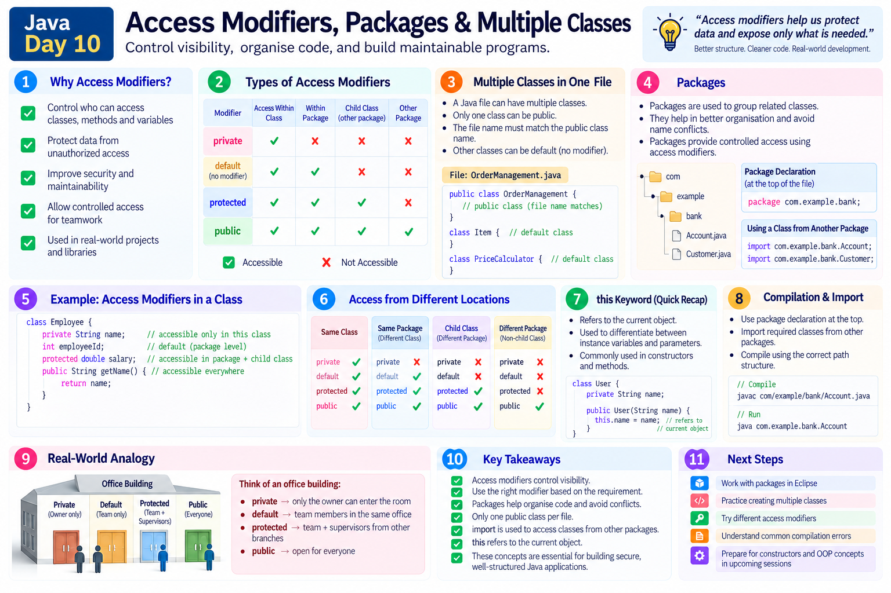

# Java Learning Journey — Day 10

## Access Modifiers, Packages & Visibility

Day 09 introduced reusable methods. Day 10 added the next practical question:

> **Who is allowed to use a class, method, or variable?**

The session connected access modifiers with multiple classes, objects, packages, imports, `this`, and Java execution flow.

---

## 1. What Does "Access" Mean?

Access means **who can use a program element**.

```text
Code
 ↓
Who should use it?
 ↓
Access Modifier
 ↓
Visibility
```

This applies to members such as variables and methods, and access rules also apply to classes.

---

## 2. The Four Access Levels

```text
private
default
protected
public
```

Mental model:

```text
private   → class
default   → package
protected → package + child class outside package
public    → other packages when accessible
```

---

## 3. `private`

A private member can be used within the class where it is declared.

```java
class OrderManagement
{
    private int orderValue = 1200;

    private void placeOrder()
    {
        System.out.println("Placing order");
    }
}
```

Another class cannot directly access those private members.

```text
OrderManagement
      │
      ├── private variable
      └── private method
              ↓
         same class only
```

**Private controls technical access; it does not mean the source code is invisible to a human reading the file.**

---

## 4. `public`

A public member can be accessed from other classes when the class/package setup permits it.

```java
class OrderManagement
{
    public void placeOrder(String itemName)
    {
        System.out.println("Placing order for " + itemName);
    }
}
```

Another class can call it through an object:

```java
OrderManagement orderManagement =
        new OrderManagement();

orderManagement.placeOrder("Laptop");
```

---

## 5. Default Access

When no access modifier is written:

```java
int amount;
```

the member has **default (package-private) access**.

```java
int amount;          // default
private int amount;  // private
public int amount;   // public
```

There is no `default` keyword that you write before the member.

Key rule:

> **Default access is available within the same package.**

```text
Same package    → accessible
Different package → not directly accessible
```

---

## 6. `protected`

The session introduced `protected` as:

```text
Same package
      +
Child class outside the package
```

So a protected member can be accessed by classes in the same package and by an appropriate child class in another package.

The inheritance relationship was only introduced here; its deeper behavior becomes clearer when inheritance is studied.

---

## 7. Access Modifier Map

```text
                 VISIBILITY
                     │
       ┌─────────────┼─────────────┐
       │             │             │
    private       default       protected       public
       │             │             │               │
     class         package     package +        other packages
                               child class      when accessible
```

Quick memory rule:

```text
private   → Class
default   → Package
protected → Package + Child
public    → Wider access
```

---

## 8. Multiple Classes and One Entry Point

Day 10 connected access modifiers with multi-class applications.

```text
Driver
  │
  │ main()
  ↓
OrderManagement
  │
  │ placeOrder()
  ↓
Other application logic
```

Not every class needs a `main()` method.

Example:

```java
class Driver
{
    public static void main(String[] args)
    {
        // application starts here
    }
}
```

Another class can contain functionality:

```java
class OrderManagement
{
    public void placeOrder(String itemName)
    {
        // order logic
    }
}
```

The JVM starts execution through the `main()` method of the class being launched.

---

## 9. Object-Based Method Calling

A non-static method can be called through an object:

```java
OrderManagement orderManagement =
        new OrderManagement();

orderManagement.placeOrder("Laptop");
```

Flow:

```text
Driver.main()
     ↓
create object
     ↓
object.method()
     ↓
OrderManagement method
     ↓
control returns
```

This connects the method lesson from Day 09 with object usage.

---

## 10. `this` — Current Object

The session also introduced `this`.

`this` represents the **current object**.

```java
class OrderManagement
{
    int orderValue;

    void display()
    {
        System.out.println(this.orderValue);
    }
}
```

Mental model:

```text
this
 ↓
current object
```

The session also showed that, in an instance context, the current object reference can be implicit.

```java
orderValue
```

can refer to the current object's member, while:

```java
this.orderValue
```

makes the relationship explicit.

---

## 11. What Is a Package?

A package organizes Java classes.

```text
package
   ↓
folder-like organization
   ↓
Java classes
```

Example:

```text
account/
    Account.java
    AccountService.java

user/
    User.java
    UserService.java
```

Packages help organize code and avoid naming conflicts.

---

## 12. Why Packages Matter

Different application areas may need classes with the same simple name:

```text
retail.Order
reseller.Order
```

Packages distinguish them.

```text
Package
   ↓
Organize related classes
   +
Avoid naming conflicts
```

---

## 13. Package Naming

The session introduced the common convention of using a reverse domain name as the beginning of a package.

For example:

```text
example.com
```

can lead to:

```text
com.example
```

and then:

```text
com.example.account
com.example.user
```

The important idea is consistent organization and avoiding naming conflicts.

---

## 14. Using a Class from Another Package

Suppose:

```text
account/
    Account.java

user/
    User.java
```

If `User` needs `Account`, the class is in another package.

It can be imported:

```java
import account.Account;
```

Then:

```java
Account account = new Account();
```

The practical flow was:

```text
Same package
    ↓
class can be resolved directly

Different package
    ↓
import the class
    ↓
check access modifier
    ↓
use it if accessible
```

---

## 15. Import Does Not Override Access Rules

A key practical lesson:

```text
import ≠ permission
```

Import tells Java **where to find the type**.

The access modifier determines **whether that type/member can be used**.

For example, importing a class does not make a package-private class public.

---

## 16. Reading Compilation Errors

The practical exercise deliberately changed access modifiers and compiled again.

A useful debugging process is:

```text
Read the error
     ↓
Find file/class
     ↓
Find line number
     ↓
Identify access modifier
     ↓
Check same/different package
     ↓
Fix the actual cause
```

Instead of guessing, use the compiler message as information.

---

## 17. Recompile After Source Changes

When a Java source file changes:

```text
.java
  ↓
modify
  ↓
javac
  ↓
updated .class
  ↓
java
```

The session demonstrated this while changing access levels such as:

```text
public → default
public → private
```

and recompiling before testing again.

---
## Visual Note



---

# Quick Revision

### Access Modifiers

```text
private
→ same class

default
→ same package

protected
→ same package
  + appropriate child class outside package

public
→ accessible from other packages
  when the class/member is otherwise accessible
```

### Package

```text
Package
  ↓
Organizes classes
  ↓
Helps avoid naming conflicts
  ↓
Creates a boundary for package-level access
```

### Import

```text
Different package
      ↓
import the class
      ↓
check access modifier
      ↓
use if accessible
```

### `this`

```text
this
 ↓
current object
```

---

# Key Takeaway

Day 10 changed the question from:

> **"Can I call this method?"**

to:

> **"Who is allowed to call this method?"**

That distinction is an important step toward understanding how Java applications control visibility and organize multiple classes.

```text
Multiple Classes
       ↓
Methods / Variables
       ↓
Access Modifiers
       ↓
Packages
       ↓
Controlled Visibility
```

**Good Java code is not only about making something work; it is also about controlling what other parts of the application are allowed to use.**

---

## Repository Structure

```text
Day-10/
├── OrderManagement.java
├── Driver.java
└── README.md
```
