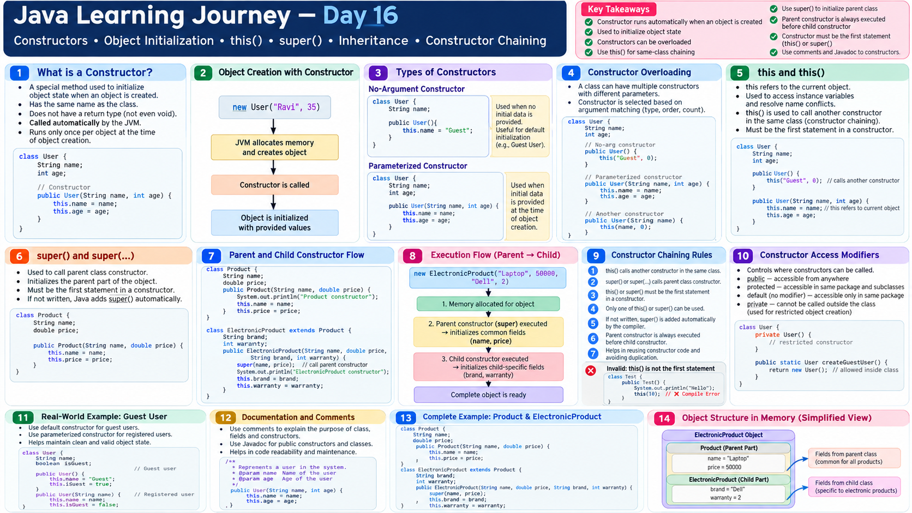

# Java Learning Journey — Day 16

## Constructors in Practice, Documentation Comments & Inheritance-Based Constructor Chaining

Day 16 continued the work on constructors, but moved from simply understanding constructor syntax to understanding **why different constructors exist, how constructors are selected, how access rules affect constructors, and how constructor chaining works across parent and child classes**.

The session also introduced a practical developer habit: writing documentation comments so another developer can understand the purpose of a class or method without reading the entire implementation first.

---

## 1. Constructors Are About Object Initialization

A constructor is used when an object is created and helps initialize the object's state.

The session connected object creation with constructor selection:

```text
new
 ↓
Object creation
 ↓
Matching constructor
 ↓
Object state initialization
```

The constructor has the same name as the class.

---

## 2. Documentation Comments — Helping Other Developers Understand the Code

One of the first practical topics in the session was documentation through Java comments.

The idea was simple:

> A developer joining an existing project should not have to read an entire complex implementation just to understand what a class or method is intended to do.

The session demonstrated documentation-style comments using:

```java
/**
 * Description of the class or method.
 */
```

In an IDE, hovering over documented code can show the description to another developer.

### Why this matters

As application logic becomes more complex, a developer often needs a quick explanation before going into the implementation.

A practical reading flow becomes:

```text
Read documentation
      ↓
Understand purpose
      ↓
Decide whether implementation needs inspection
      ↓
Read source code when necessary
```

The session used the idea of working on a large real-world application such as a ride-booking system: a developer would not normally start by reading every line of a complex implementation.

---

## 3. Constructor Parameters Initialize Object State

A constructor can receive values from the code creating the object and use those values to initialize instance fields.

Example pattern discussed in the session:

```java
class User
{
    String name;
    String type;
    String country;

    User(String name, String type, String country)
    {
        this.name = name;
        this.type = type;
        this.country = country;
    }
}
```

The important idea is that the object receives information at creation time and the constructor uses that information to establish its initial state.

---

## 4. More Than One Constructor Can Represent Different Creation Scenarios

The session used a practical application example to show why a class may need different constructors.

A system may sometimes have complete information about a user and sometimes only have minimum information.

For example:

```text
Guest user
   ↓
Minimum information
   ↓
System creates remaining/default information
```

Later:

```text
Registered user
   ↓
More complete information
   ↓
Constructor receives the actual details
   ↓
Object is initialized with those details
```

This gives a practical reason for having constructors with different parameter lists.

---

## 5. Constructor Selection Depends on the Arguments

The session repeatedly demonstrated that the constructor being called depends on the arguments supplied with `new`.

Conceptually:

```text
new User()
     ↓
no-argument constructor
```

while:

```text
new User("Ravi", "Guest", "India")
     ↓
matching constructor with three parameters
```

The important reasoning skill is not simply memorizing constructor syntax, but asking:

> **Which constructor signature matches this object creation statement?**

---

## 6. No-Argument Constructor and Constructor Availability

The session examined what happens when an object is created without arguments and when a class has constructors that require arguments.

The practical point demonstrated was:

```java
new User()
```

requires an available no-argument constructor.

If the available constructor expects arguments, the no-argument object creation does not match it.

The session also discussed explicitly having a no-argument constructor as a useful design choice when a class needs that creation path.

---

## 7. Constructors Also Have Access Scope

A constructor follows the same access-scope idea that applies to other class members.

The session demonstrated what happens when a constructor has no access modifier:

```java
class Product
{
    Product()
    {
    }
}
```

This constructor has default/package-private access.

If the object is created from the same package, it can be accessed.

If the object is created from another package, the constructor is not directly accessible.

Making the constructor `public` changes that access:

```java
public Product()
{
}
```

The session reinforced the broader rule:

```text
public    → wider access

default   → same package

private   → same class

protected → package + appropriate subclasses
```

The key point was that the scope rule applies to constructors as well as classes, methods and variables.

---

## 8. Think Like the Developer of the Application

A recurring practical approach in the session was to switch between two roles:

```text
Developer
   ↓
Design the class and constructors

User
   ↓
Use the application and trigger object creation
```

The Netflix-style example demonstrated this clearly.

As the developer, you design the `User` class and decide how objects can be created.

As the application user, you provide only the information the interface asks for.

The backend can then create and initialize the corresponding object.

This role-switching approach was presented as a way to understand why a particular constructor exists rather than simply memorizing its syntax.

---

## 9. Real-World Example — Guest User vs Complete User

The session used a practical user-registration scenario.

A user may initially provide only minimum information. The application can create a user object and use system-generated/default information for the remaining state.

Later, when the user provides more information, another constructor can be used for the more complete object state.

Conceptually:

```text
Minimum input
     ↓
Guest / initial object
     ↓
Application generates or assigns remaining state
```

and:

```text
Complete user details
     ↓
Matching constructor
     ↓
Fully initialized user object
```

The important lesson was that constructor design can reflect different real-world object-creation requirements.

---

## 10. A Constructor Is Not Called Again on an Existing Object

An important clarification came near the end of the session.

After creating an object through a constructor, you do not simply call another constructor on that same existing object to change its state.

The demonstrated mental model was:

```text
Constructor call
      ↓
new object
```

If another constructor is required, another object creation operation is involved:

```text
new Product()
      ↓
Object 1

new Product("Phone", ...)
      ↓
Object 2
```

For changing an existing object's state, the session distinguished that from calling a constructor again.

---

## 11. Inheritance Example — Product and ElectronicProduct

The second major practical example used a product hierarchy.

The common product class contained attributes applicable to products generally, such as:

```text
name
price
productId
```

An `ElectronicProduct` was then treated as a more specific type of product and had its own specific attribute, such as:

```text
warranty
```

The model became:

```text
Product
  ├── name
  ├── price
  └── productId

       ↓ extends

ElectronicProduct
  └── warranty
```

This demonstrated why a common class can hold common attributes while a child class can hold attributes specific to that type.

---

## 12. Eclipse Can Generate Constructors

During the practical work, the session demonstrated Eclipse's constructor-generation feature.

The workflow shown was essentially:

```text
Right click
   ↓
Source
   ↓
Generate Constructor using Fields
```

This helps generate constructor code from the class fields instead of manually writing every assignment.

The important point is not just the shortcut itself, but recognizing that an IDE can generate repetitive code while the developer still needs to understand what the generated constructor does.

---

## 13. `super(...)` — Initialize the Parent Part

The product example introduced the practical use of `super(...)`.

`super(...)` is used to call a constructor of the parent class.

For example, if `Product` owns the common fields:

```text
Product
 ├── name
 ├── price
 └── productId
```

and `ElectronicProduct` owns:

```text
warranty
```

the child constructor can pass the common values to the parent constructor using `super(...)`.

Conceptually:

```text
ElectronicProduct constructor
          ↓
      super(...)
          ↓
Product constructor
          ↓
Initialize common fields
          ↓
Return to child constructor
          ↓
Initialize warranty
```

---

## 14. Why Use `super(...)` Here?

The session emphasized avoiding repeated initialization code.

Without using the parent constructor, the child class would have to repeat initialization logic for common fields.

With `super(...)`:

```text
Common initialization
        ↓
Parent constructor

Specific initialization
        ↓
Child constructor
```

This keeps common product initialization in the common `Product` class.

The session described this as a way to avoid code duplication.

---

## 15. Runtime State of the Child Object

A key debugging observation was that the resulting `ElectronicProduct` object contains both the inherited/common fields and its own specific field.

Conceptually:

```text
ElectronicProduct object

name
price
productId
warranty
```

The debugger was used to follow the initialization sequence and observe the object's state.

The execution flow demonstrated:

```text
Create ElectronicProduct
        ↓
Child constructor
        ↓
super(...)
        ↓
Product constructor
        ↓
Initialize common fields
        ↓
Return to child
        ↓
Initialize warranty
        ↓
Complete object
```

This connected constructor syntax with actual runtime behaviour.

---

## 16. `this` vs `super`

The session ended by explicitly comparing the two constructor-call mechanisms.

### `this(...)`

Used to call another constructor in the **same class**.

```text
this(...)
   ↓
Another constructor
in the same class
```

### `super(...)`

Used to call a constructor in the **superclass / parent class**.

```text
super(...)
    ↓
Parent constructor
```

The simplest mental model from the session is:

```text
this(...)  → same class

super(...) → parent class
```

---

## 17. Constructor Chaining

The session defined constructor chaining as calling one constructor from another constructor using either `this(...)` or `super(...)`.

```text
Constructor
     ↓
constructor call
     ↓
another constructor
```

There are two directions discussed:

```text
this(...)
   ↓
Same-class constructor
```

and:

```text
super(...)
   ↓
Superclass constructor
```

This is why `this(...)` and `super(...)` are central to understanding constructor chaining.

---

## 18. First Statement Rule

The session reinforced an important constructor rule:

The constructor call must be the first statement.

Conceptually:

```java
Constructor()
{
    this(...);     // constructor call first
    // remaining statements
}
```

or:

```java
Constructor()
{
    super(...);    // constructor call first
    // remaining statements
}
```

If neither is explicitly written, the session discussed the implicit no-argument `super()` call.

The mental model was:

```text
Constructor begins
      ↓
this(...) OR super(...)
      ↓
Continue constructor body
```

---

## 19. The Complete Constructor-Chaining Picture

By the end of the session, the constructor model had moved beyond simply:

```text
new Object()
```

and toward:

```text
new Child(...)
      ↓
Child constructor
      ↓
super(...)
      ↓
Parent constructor
      ↓
Initialize common state
      ↓
Return to child
      ↓
Initialize child-specific state
      ↓
Object ready
```

For same-class constructor reuse:

```text
Constructor A
     ↓
this(...)
     ↓
Constructor B
```

The important distinction is **where the next constructor lives**.

---

## Practical Learning Map

```text
Object Creation
      ↓
Constructor
      ↓
Constructor Parameters
      ↓
Multiple Creation Scenarios
      ↓
Constructor Matching
      ↓
Access Scope
      ↓
Inheritance
      ↓
Parent / Child Constructors
      ↓
this(...)
      ↓
super(...)
      ↓
Constructor Chaining
      ↓
Runtime Object State
```

Alongside this, the session introduced another developer habit:

```text
Complex Code
     ↓
Documentation Comment
     ↓
Understand Purpose First
     ↓
Inspect Implementation When Needed
```

---

## Practical Focus

The session's practical work connected Java syntax with application-style scenarios:

- User creation and registration
- Guest-user initialization
- Different constructor parameter sets
- Constructor access across packages
- Product and electronic-product class design
- Eclipse constructor generation
- Parent/child constructor initialization
- `super(...)` for common-field initialization
- Debugging object state during constructor execution
- Comparing `this(...)` and `super(...)`

---
## Visual Note



---

## Key Takeaways

- Constructors initialize an object's state during object creation.
- Constructor names match their class names.
- Different constructors can represent different object-creation scenarios.
- Constructor selection depends on the arguments supplied to `new`.
- A no-argument object creation requires an available no-argument constructor.
- Constructor access follows the same scope principles discussed for other members.
- Default/package-private constructors are accessible within the same package.
- `this(...)` calls another constructor in the same class.
- `super(...)` calls a constructor in the parent class.
- Constructor calls must occur first in the constructor.
- If neither is explicitly written, the session discussed the implicit no-argument `super()` call.
- `super(...)` can keep common parent initialization in the parent class instead of duplicating it in child classes.
- A child object can contain inherited/common state together with its own specific state.
- Constructor chaining is about one constructor calling another constructor.
- A constructor is not something you call again on an already-created object to update that object's state.
- Documentation comments help developers understand the purpose of existing code before reading the full implementation.
- Debugging makes the constructor and initialization sequence visible at runtime.

---

## The Bigger Lesson

The important shift in this session was from **knowing constructor syntax** to **reasoning about object creation and initialization design**.

Instead of seeing:

```java
new ElectronicProduct(...)
```

as a single line, the runtime picture becomes:

```text
new ElectronicProduct(...)
          ↓
ElectronicProduct constructor
          ↓
super(...)
          ↓
Product constructor
          ↓
Common fields initialized
          ↓
Return to ElectronicProduct
          ↓
Specific field initialized
          ↓
Object state completed
```

That makes `this(...)`, `super(...)`, constructor matching, inheritance and debugging part of one connected concept rather than separate Java rules.

---

## Repository Structure

```text
Day-16/
├── README.md
├── PRACTICE-QUESTIONS.md
└── Exercises/
```

The practice questions and visual material for this session can build on the same constructor, access-scope, inheritance and debugging scenarios covered here.
