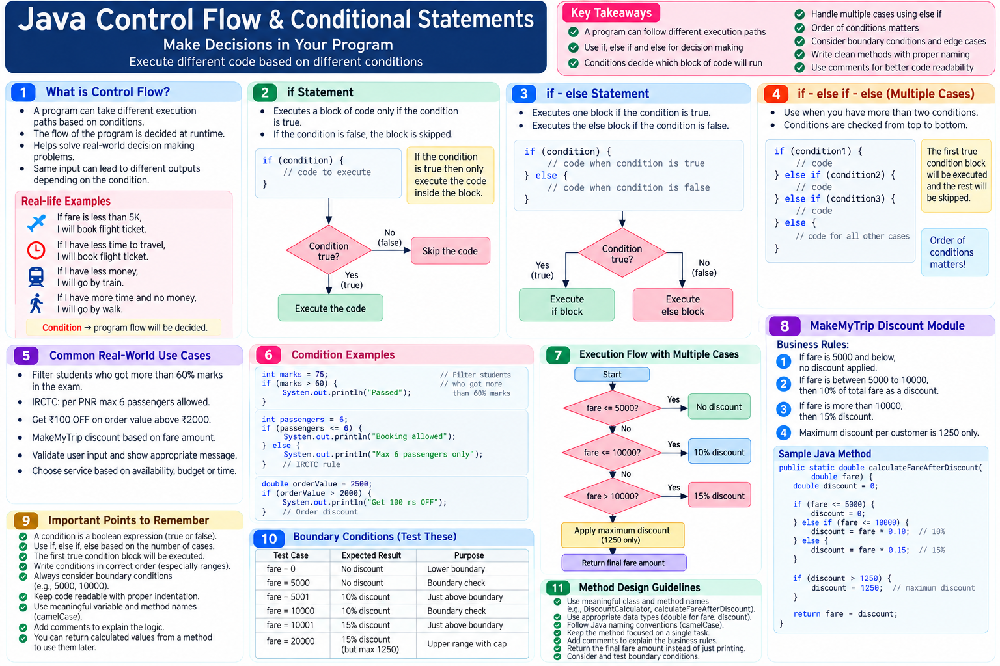

# Java Learning Journey — Day 17
## Control Flow: Making Program Decisions with `if`, `else`, and `else if`

Today’s session introduced **control flow** — how a program chooses different execution paths based on conditions.

The key idea was simple:

> **A condition decides which part of the program should execute.**

Instead of writing code that always follows the same path, we can make the program respond to different business situations.

---

## 1. What Is Control Flow?

When software runs, it does not always have to follow one identical execution path.

A program may need to decide:

- If a fare is within a certain budget, choose one option.
- If there is less time to travel, choose another option.
- If the budget is low, use a different travel method.
- If a student scored more than 60%, include that student.
- If an order crosses a certain amount, apply a discount.
- If a booking contains more than the allowed passengers, reject it.

These decisions are represented through **conditions**.

The condition determines the program flow.

---

## 2. `if` — Execute Code Only When a Condition Is True

The basic structure introduced was:

```java
if (condition) {
    // code
}
```

The meaning is:

**If the condition is true, execute the block.**

If the condition is false, the block is skipped and execution continues after it.

For example, an IRCTC-style booking requirement was used:

> More than 6 passengers should not be allowed for one PNR.

Conceptually:

```java
if (numberOfPassengers > 6) {
    // do not allow the booking
}
```

The important part is not the particular booking example. It is the execution rule:

```text
Condition
   │
   ├── true  → execute the if block
   │
   └── false → skip the if block
```

---

## 3. Conditions Represent Business Rules

A useful way to understand control flow is to think in terms of **business requirements**.

Examples discussed during the session:

- Filter students who scored more than 60%.
- Allow a maximum of 6 passengers per PNR.
- Apply an offer when an order reaches a required value.
- Decide a travel plan based on budget.
- Select a discount based on fare.

The developer's job is to translate these requirements into conditions and execution logic.

So the flow becomes:

```text
Business Requirement
        ↓
Condition
        ↓
Decision
        ↓
Execution Logic
```

---

## 4. `if` and `else` — Two Possible Paths

Sometimes the program must choose between two alternatives.

That is where `else` is used:

```java
if (condition) {
    // first path
} else {
    // second path
}
```

The important rule:

- If the `if` condition is **true**, the `if` block executes.
- If the `if` condition is **false**, the `else` block executes.
- In one execution, one of these two paths is selected.

The booking example demonstrated this clearly:

```text
             Condition
                 │
          ┌──────┴──────┐
        true           false
          │               │
       if block        else block
```

For example:

```java
if (numberOfPassengers > 6) {
    // reject booking
} else {
    // continue booking
}
```

With 5 passengers, the condition is false, so the booking path is executed.

With 15 passengers, the condition is true, so the restriction path is executed.

---

## 5. What If There Are Multiple Cases?

A simple `if-else` handles two alternatives.

But real applications often have more than two cases.

The session used a budget example:

```text
Budget < 1,000
1,000 to 3,000
3,000 to 5,000
Above 5,000
```

Now there are multiple possible conditions.

Java provides:

```java
if (...) {
    // condition 1
} else if (...) {
    // condition 2
} else if (...) {
    // condition 3
} else {
    // none of the previous conditions matched
}
```

This is useful when a requirement has several mutually exclusive cases.

---

## 6. `else if` — Multiple Decision Paths

The session demonstrated a trip-planner example where the suggested plan changes according to budget.

The conceptual flow was:

```text
Budget
  │
  ├── ≤ 1,000
  │      → first plan
  │
  ├── 1,000 to 3,000
  │      → second plan
  │
  ├── 3,000 to 5,000
  │      → third plan
  │
  └── otherwise
         → final plan
```

The important behavior is that the conditions are checked in sequence.

Once a matching condition is found, its block executes and the remaining `else if` conditions are not checked for that execution.

That makes the order of conditions important.

---

## 7. Why Condition Order Matters

Consider:

```text
if condition 1
else if condition 2
else if condition 3
else
```

The program evaluates the chain from top to bottom.

The session demonstrated this while debugging the trip planner:

```text
Check condition 1
      ↓
if false → check next condition
      ↓
if false → check next condition
      ↓
matching condition found
      ↓
execute that block
      ↓
leave the remaining conditions
```

So when designing an `else if` chain, the developer needs to think carefully about the ranges and boundaries.

This becomes especially important in pricing, discounts, eligibility rules, tax slabs, booking rules, and similar business logic.

---

## 8. Debugging Control Flow

The session also used Eclipse debugging to understand which path the program was taking.

Breakpoints were used together with:

- **F5 — Step Into**
- **F6 — Step Over**

The debugging process made the execution path visible.

For example, when the passenger count was `5`:

```text
numberOfPassengers > 6
            ↓
          false
            ↓
       skip if block
            ↓
       execute else
```

When the passenger count was greater than `6`:

```text
numberOfPassengers > 6
            ↓
           true
            ↓
       execute if block
            ↓
       skip else
```

This is useful because control-flow problems are often easier to understand by following the actual runtime path rather than only reading the source code.

---

## 9. Returning a Result Instead of Only Printing It

An important practical point came up while reviewing the discount-module solutions.

The mentor emphasized that a method should not simply print the calculated result when the caller needs to use that result.

For example, a calculation method that receives an amount and calculates a discount should generally return the calculated numeric value rather than only doing:

```java
System.out.println(...);
```

The caller can then use the returned value.

The discussion specifically pointed out that a calculation method's return type should reflect the value being returned, such as an appropriate numeric type, rather than using `void` when a result is expected.

This connects control flow with an earlier concept:

```text
Input
  ↓
Method
  ↓
Conditions
  ↓
Calculation
  ↓
Return result
  ↓
Caller uses result
```

---

## 10. Static vs Non-Static Method — Practical Connection

A short discussion revisited why a method may be non-static.

The session's distinction was:

### Non-static method

Useful when the method works with **object-related data**.

Example discussed:

- A user's booking/fund-transfer operation works with that particular user's data.

### Static method

Useful when the operation does not depend on a particular object's state.

Example discussed:

- A calculation where values such as amount and percentage are supplied and a result is produced.

This was not a new deep dive into `static`; it was used to explain why the booking method was being called through an object.

---

## 11. Comments and Code Structure

The session repeatedly emphasized that developers should not focus only on getting the output.

Code should also have:

- meaningful class names
- meaningful method names
- proper Java naming conventions
- appropriate comments
- readable structure
- clear responsibility

The task review specifically criticized solutions that:

- put everything into one class
- only printed the expected answer
- used `void` when the calculated value should be returned
- ignored method naming conventions
- did not handle edge/corner scenarios

The point was:

> **The quality of the code structure matters, not just whether the console shows the expected output.**

---

# 12. Practical Task — MakeMyTrip Discount Module

The main practical task was to design a **MakeMyTrip discount module** using the control-flow concepts covered in the session.

The stated business requirements were:

### Requirement 1

If the fare is **5,000 and below**:

```text
No discount
```

### Requirement 2

If the fare is **between 5,000 and 10,000**:

```text
10% discount
```

### Requirement 3

If the fare is **more than 10,000**:

```text
15% discount
```

### Requirement 4

The maximum discount allowed per customer is:

```text
₹1,250
```

The implementation was expected to use:

- proper Java naming conventions
- proper class structure
- proper method structure
- meaningful comments
- readable code
- a sensible separation of responsibility
- a returned calculation result rather than simply printing the answer

### Important boundary observation

The stated requirements contain a boundary that needs to be handled deliberately:

- `5,000 and below` → no discount
- `between 5,000 to 10,000` → 10%

Because `5,000` appears in both descriptions, the exact boundary rule at ₹5,000 should be clarified before treating the requirement as final business logic.

This is a useful real-world lesson: **requirements themselves can contain ambiguous boundaries, and code should not silently invent the business rule.**

---

# 13. Corner Scenarios Matter

During the review of solutions, the mentor tested values such as:

- `20,000`
- `15,000`
- negative input such as `-1`

The negative-value example showed why developers should think beyond the normal/happy path.

A calculation may appear correct for ordinary values while behaving incorrectly for unexpected input.

So after implementing a condition-based module, test:

```text
normal values
boundary values
large values
unexpected values
```

The exact validation rules for invalid fare values were not fully specified in the session, so they should not be invented without a requirement.

---

# 14. A Better Mental Model for `if`, `else if`, `else`

Think of the structure as a decision tree:

```text
                 START
                   │
              condition 1?
              /           \
           true            false
            │                │
       execute block 1   condition 2?
                           /       \
                        true       false
                         │           │
                  execute block 2  condition 3?
                                    /      \
                                 true      false
                                  │          │
                           execute block 3  else
                                             │
                                      default path
```

The program is not executing every block.

It is **choosing a path**.

That is the central idea of control flow.

---

# 15. What I Learned Today

The important shift today was from writing statements sequentially to thinking about **decision-based execution**.

The main concepts were:

- Control flow
- Conditions
- `if`
- `if-else`
- `else if`
- Multiple execution paths
- Sequential evaluation of an `else if` chain
- Only the matching branch executing
- Debugging the selected execution path
- Returning calculation results from methods
- Static vs non-static methods in practical context
- Meaningful naming
- Comments and readable structure
- Business requirements and boundary conditions
- Corner/edge-case thinking

---

# 16. Practical Developer Thinking

A condition should not be written just because Java provides `if`.

Start with the requirement:

```text
What decision does the business need?
          ↓
What condition represents that decision?
          ↓
What should happen when it is true?
          ↓
What should happen when it is false?
          ↓
Are there more cases?
          ↓
Are the boundaries clear?
          ↓
What result should the method return?
          ↓
What happens for unexpected inputs?
```

That way, control flow becomes a way to translate **business rules into executable logic**.

---
## Visual Note




---

## Repository Practice

Suggested structure for this session:

```text
Day-17/
├── README.md
└── Exercises/
    ├── Booking.java
    ├── TripPlanner.java
    └── MakeMyTripDiscount.java
```

The filenames above represent the practical areas covered in the session; they can be adjusted to match the actual files created during practice.

---

## Day 17 Boundary

Today's practice should stay within:

- `if`
- `if-else`
- `else if`
- conditions and comparisons
- execution-path reasoning
- method parameters and return values
- basic object/non-static method usage already covered
- naming conventions
- comments
- debugging with the Eclipse techniques demonstrated

---

## One-Line Takeaway

**Control flow lets a Java program choose what to execute based on business conditions instead of following one fixed path.**
