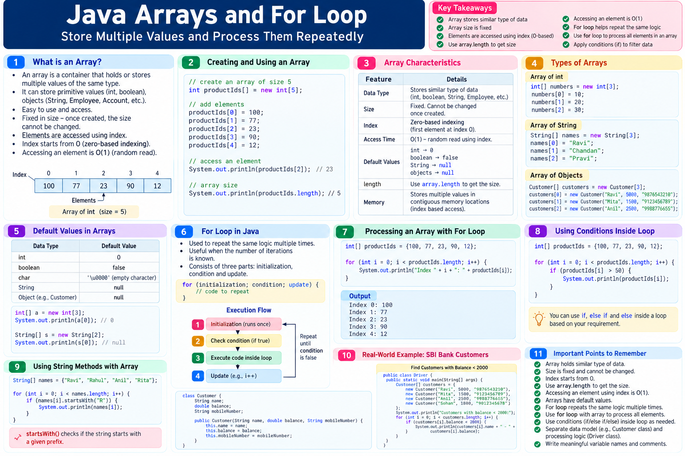

# Java Learning Journey
## Arrays and the `for` Loop: Storing, Accessing, and Processing Data

Today’s session moved from individual values to working with **groups of similar data** and then introduced the need to repeat logic efficiently.

The session covered two connected ideas:

1. **Arrays** as containers for similar-type data.
2. **`for` loops** for repeating logic when the input size or number of iterations is known.

The examples moved from integer arrays to `String` arrays, arrays of custom objects, and finally a practical customer-filtering requirement.

---

# 1. What Is an Array?

An array was introduced as a **container or bucket** that can hold/store similar-type data.

Examples discussed included arrays of:

- `int`
- `boolean`
- `String`
- `Employee`
- `Account`
- `Delivery`
- `Invoice`
- `Notification`
- `User`

The important idea is to treat related data as **one organized unit** rather than handling every value separately.

For example, if an application has many users, they can be grouped into a `User` array.

---

# 2. Why Use an Array?

The session used a real-life **basket** analogy.

If apples are scattered around a kitchen, finding or carrying a group of apples is inconvenient.

If the apples are organized into a basket, the basket gives us one organized unit to work with.

The same idea applies to arrays:

```text
Many related values
        ↓
     Array
        ↓
One organized unit
        ↓
Easy to access and process
```

The session emphasized **easy use/access** as a major advantage of organizing similar data together.

---

# 3. Arrays Are Fixed in Size

One of the main properties discussed was:

> Once an array is created, its size cannot be changed dynamically.

For example:

```java
int productIds[] = new int[5];
```

This creates an array with space for **5 integer elements**.

The session demonstrated that if the program later needs more elements, the existing array cannot simply be expanded at runtime.

The code would need to be changed and the program run again with a different array size.

So:

```text
Array created with size 5
        ↓
Capacity = 5
        ↓
Cannot dynamically increase it
```

Collections were mentioned as something that would be covered later, but they were not explored in this session.

---

# 4. Index-Based Access

Arrays use an **index** to identify the position of an element.

Indexing starts from:

```text
0
```

For an array of size 5:

```text
Index:    0    1    2    3    4
          ↓    ↓    ↓    ↓    ↓
Element: [ ]  [ ]  [ ]  [ ]  [ ]
```

There is no index `5` in a five-element array.

So:

```text
Size = 5
Valid indexes = 0 to 4
```

The session repeatedly used this relationship while debugging.

---

# 5. Creating an Integer Array

The practical example created an array capable of holding five integers:

```java
int productIds[] = new int[5];
```

The array was then populated using indexes:

```java
productIds[0] = 100;
productIds[1] = 77;
productIds[2] = 23;
productIds[3] = 90;
productIds[4] = 12;
```

The resulting structure can be visualized as:

```text
Index       0      1      2      3      4
            ↓      ↓      ↓      ↓      ↓
Value      100     77     23     90     12
```

To read a particular value, use its index:

```java
System.out.println(productIds[2]);
```

This accesses the value stored at index `2`.

In the example:

```text
productIds[2] → 23
```

---

# 6. Array Size and Valid Indexes

A useful rule from the practical example:

```text
Array size = 5
First index = 0
Last index = 4
```

More generally:

```text
Last valid index = size - 1
```

This relationship becomes especially important when arrays are processed with loops.

---

# 7. Default Values in an Array

The session used debugging to observe what happens immediately after an array is created.

Before values are assigned, the integer array contains default values:

```text
[0, 0, 0, 0, 0]
```

Then values are assigned one index at a time.

For example:

```java
productIds[0] = 100;
```

changes the first position:

```text
[100, 0, 0, 0, 0]
```

Then:

```java
productIds[1] = 77;
```

results in:

```text
[100, 77, 0, 0, 0]
```

The debugger was used to observe these changes as the statements executed.

The session also discussed that a `String` array has a different default value from an integer array.

---

# 8. Debugging an Array

The session strongly emphasized using the Eclipse debugger instead of only reading the source code.

While debugging the integer-array example, the array was observed as:

```text
[100, 77, 23, 90, 12]
```

The debugger made it possible to see:

- the array variable
- individual indexes
- values stored at those indexes
- how values changed after assignment

This is particularly useful for understanding arrays because the relationship between:

```text
index → position → value
```

becomes visible at runtime.

---

# 9. Array Access and O(1)

Because an array is index-based, the session introduced:

```text
O(1)
```

for reading an element using its index.

For example:

```java
productIds[2]
```

directly accesses the element at index `2`.

The session described this as **random read**.

The key idea:

```text
Known index
    ↓
Direct access
    ↓
Read the value
```

There is no need to scan the earlier elements one by one just to access a known index.

---

# 10. Arrays of `String`

Arrays are not limited to primitive values.

The session created a `String` array for city names.

Conceptually:

```java
String cities[] = new String[3];
```

Values can then be stored by index:

```java
cities[0] = "Bangalore";
cities[1] = "Chennai";
cities[2] = "Mumbai";
```

The same rules still apply:

```text
Index starts at 0
Array size is fixed
Values are accessed using indexes
```

---

# 11. Arrays of Objects

The session then connected arrays with the earlier **class and object** concepts.

Suppose there is a `User` class containing information such as:

- name
- mobile

and a constructor is available to create `User` objects.

You can create multiple `User` objects and store references to them in an array.

Conceptually:

```java
User[] users = new User[5];
```

Then objects can be assigned to positions:

```java
users[0] = user1;
users[1] = user2;
```

The important connection is:

```text
Class
  ↓
Objects
  ↓
Array of objects
```

This allows an application to organize many related objects as one group.

---

# 12. Why Object Arrays Matter in Applications

The session used the idea of a banking system with many customers.

Imagine an application has:

```text
500 customers
1,000 customers
10,000 customers
```

Instead of treating every customer separately, the application can organize customer objects into an array.

Then the application can process the group.

For example:

```text
Customer objects
       ↓
Customer array
       ↓
Process each customer
       ↓
Apply business condition
```

This is where arrays and loops naturally begin to work together.

---

# 13. The Need for Repetition

The next requirement introduced a different problem.

Suppose we have this logic:

```text
Check whether a number is greater than 21.
```

Now suppose we need to perform that same logic:

```text
100 times
```

One option would be to write the same logic 100 times.

That is clearly undesirable.

The better idea is:

```text
Write the logic once
        ↓
Repeat its execution
        ↓
Use different input values
```

This is the purpose of a **loop**.

---

# 14. Loops in Java

The session introduced three loop types:

1. `for`
2. `while`
3. `do-while`

Only the **`for` loop** was explored practically in this session.

The important requirement for the `for` loop was:

> Use it when the input size or number of iterations is known.

---

# 15. Why Use a `for` Loop?

Consider an array containing 7 cities.

If the requirement is:

> Check every city in the array and find the cities starting with `S`.

We already know the input size:

```text
7 elements
```

Therefore, we know the maximum number of iterations required.

A `for` loop is a suitable choice.

The session emphasized this as the key practical reason for choosing `for`:

```text
Known input size
       ↓
Known/fixed number of iterations
       ↓
`for` loop
```

This is more useful than simply memorizing loop syntax.

---

# 16. The Three Parts of a `for` Loop

The session broke the `for` loop into three parts:

```java
for (initialization; condition; update) {
    // business logic
}
```

### Part 1 — Initialization

Defines the starting point.

Example:

```java
int index = 0;
```

### Part 2 — Condition

Determines whether another iteration should execute.

Example:

```java
index < 10
```

### Part 3 — Update

Changes the loop variable after the body executes.

Example:

```java
index++
```

So:

```text
for (initialization; condition; update)
```

can be remembered as:

```text
START → CHECK → EXECUTE → UPDATE → CHECK → EXECUTE ...
```

---

# 17. `for` Loop Execution Order

The session used Eclipse debugging to trace the exact order.

For:

```java
for (int i = 0; i < 10; i++) {
    // logic
}
```

the flow is:

```text
1. Initialization
       ↓
2. Condition check
       ↓
3. Business logic
       ↓
4. Update
       ↓
5. Condition check
       ↓
6. Business logic
       ↓
7. Update
       ↓
      ...
       ↓
Condition becomes false
       ↓
Exit loop
```

An important point from the session:

> **Initialization happens only once.**

The condition and update participate repeatedly in the loop's execution.

---

# 18. Example: Printing 0 to 9

The session traced a loop similar to:

```java
for (int i = 0; i < 10; i++) {
    System.out.println(i);
}
```

Execution starts with:

```text
i = 0
```

Then:

```text
0 < 10 → true
```

So the body executes.

After the update:

```text
i = 1
```

Then the condition is checked again.

This continues until:

```text
i = 10
```

At that point:

```text
10 < 10 → false
```

The loop exits.

The important lesson is not only the output. It is understanding **when each part executes**.

---

# 19. `array.length`

While processing the city array, the session used:

```java
cities.length
```

The `length` property gives the size of the array.

For example, if the array contains 7 elements:

```java
cities.length
```

produces:

```text
7
```

This works naturally with a `for` loop:

```java
for (int index = 0; index < cities.length; index++) {
    // process cities[index]
}
```

This avoids hardcoding the array size.

---
## Visual Note



---

# 20. Processing Every Array Element

The general pattern demonstrated was:

```java
for (int index = 0; index < array.length; index++) {
    // process array[index]
}
```

This connects the concepts learned today:

```text
Array
  ↓
Index
  ↓
`array.length`
  ↓
`for` loop
  ↓
Process each element
```

This pattern is fundamental when working with arrays.

---

# 21. Searching the City Array

The practical example involved finding cities that start with `S`.

The idea was:

```text
Read one city
      ↓
Check whether it starts with S
      ↓
If true
      ↓
Print the city
      ↓
Move to next index
```

The session used the String method:

```java
startsWith()
```

which produces a boolean result.

Conceptually:

```java
if (cities[index].startsWith("S")) {
    System.out.println(cities[index]);
}
```

The condition becomes:

```text
true  → city is printed
false → city is skipped
```

---

# 22. Why the Array and `for` Loop Work Together

The city example demonstrates the relationship clearly:

```text
cities array
    ↓
index 0
    ↓
check city
    ↓
index 1
    ↓
check city
    ↓
index 2
    ↓
check city
    ↓
...
    ↓
last index
```

The `for` loop controls the repetition.

The array provides the data.

The `if` condition decides whether the current element satisfies the requirement.

So the complete structure is:

```text
Array
  ↓
for loop
  ↓
current index
  ↓
current element
  ↓
if condition
  ↓
required action
```

---

# 23. `for` Loop vs `while` Loop — Session-Level Understanding

The session briefly compared `for` and `while`.

The key distinction introduced was:

### `for`

Use when the number of iterations/input size is known upfront.

Example:

```text
Array has 7 elements
→ process up to 7 elements
```

### `while`

The session described it as useful when the number of executions is not known in advance.

For example, the loop might execute:

```text
1 time
100 times
or another number of times
```

depending on when the condition becomes false.

The session did not go deeply into `while` syntax, so this distinction should remain at this introductory level.

---

# 24. Practical Requirement — SBI Customers

The main practical exercise was based on an SBI banking scenario.

Each customer has:

```text
Customer name
Account balance
Mobile number
```

The requirement:

> Find customers whose account balance is less than ₹2,000 and print their name and balance.

The intended design discussed during the session was:

```text
Customer class
      ↓
Create customer objects
      ↓
Store customer objects in an array
      ↓
Use a `for` loop to process the array
      ↓
Check balance < 2000
      ↓
Print matching customer details
```

---

# 25. Separate Storage and Processing

During the practical review, an important coding-structure point was emphasized.

The program has two different responsibilities:

### Storage

Create customers and store them in the array.

```text
Create objects
      ↓
Store objects
```

### Processing

Iterate through the array and apply the condition.

```text
Read array
      ↓
for loop
      ↓
check balance
      ↓
print matching details
```

Keeping these responsibilities understandable makes the program easier to read and debug.

---

# 26. Professional Class Structure

The session specifically instructed developers not to put everything into one class.

For the customer requirement, a clean conceptual structure is:

```text
Customer
    ↓
Represents customer data

Driver
    ↓
Creates objects
Stores them
Processes the array
```

The exact project structure can vary, but the important lesson is to keep the **custom data model** separate from the **driver/execution code**.

---

# 27. Debugging Arrays + Loops

Debugging was again emphasized during the practical exercises.

For a loop, the debugger can show:

```text
index = 0
condition = true
current array element
business condition result
index = 1
condition = true
...
```

This is especially useful when you are learning how an array and loop interact.

Instead of guessing what the program is doing:

```text
Set breakpoint
    ↓
Run in Debug
    ↓
Use step execution
    ↓
Watch index
    ↓
Watch current object/value
    ↓
Observe condition
```

The session strongly encouraged regular debugging practice.

---

# 28. A Developer's Mental Model

Today's concepts connect into one larger pattern:

```text
Need to store many similar values
             ↓
           Array
             ↓
      Need to process them
             ↓
          `for` loop
             ↓
       Current index
             ↓
      Current array value
             ↓
       Apply condition
             ↓
      Perform required action
```

This is more important than memorizing individual syntax fragments.

---

# 29. Common Mistakes to Avoid

### Mistake 1 — Forgetting zero-based indexing

For an array of size 5:

```text
0, 1, 2, 3, 4
```

not:

```text
1, 2, 3, 4, 5
```

### Mistake 2 — Using the size as the last index

If:

```java
array.length
```

is `5`, the last valid index is:

```text
4
```

### Mistake 3 — Hardcoding array size in the loop

Prefer:

```java
index < array.length
```

when processing the entire array.

### Mistake 4 — Confusing the array with the element

These are different:

```java
cities
```

and:

```java
cities[index]
```

The first refers to the array.

The second accesses one element.

### Mistake 5 — Repeating the same logic manually

If the same operation needs to run many times, consider a loop instead of copying the same code repeatedly.

### Mistake 6 — Putting everything in one class

Separate the data model from the driver/execution responsibility when the requirement calls for it.

---

# 30. What I Learned Today

The major concepts from the session were:

- Array as a container/bucket
- Similar-type data
- Organizing related data as one unit
- Easy access
- Fixed array size
- Index-based access
- Zero-based indexing
- Array creation
- Assigning values using indexes
- Reading values using indexes
- Default values
- Arrays of primitive types
- Arrays of `String`
- Arrays of objects
- `O(1)` random read
- `array.length`
- Need for repetition
- Loops in Java
- `for` loop
- Initialization
- Condition
- Business logic
- Update
- `for` loop execution order
- Known input size / fixed iteration count
- Processing arrays using `for`
- `startsWith()` for the city-search example
- Eclipse debugging
- Customer filtering using an object array
- Separating storage and processing
- Separate custom class and driver class

---

# 31. Practical Developer Pattern

A useful pattern from today's session is:

```text
Requirement
     ↓
Identify the data
     ↓
Create a suitable class/array
     ↓
Store the data
     ↓
Determine whether the input size is known
     ↓
Use `for` when the iteration count/input size is known
     ↓
Access each element using its index
     ↓
Apply the business condition
     ↓
Process the matching data
```

For the banking example:

```text
Customer objects
      ↓
Customer[]
      ↓
for loop
      ↓
customer[index]
      ↓
balance < 2000
      ↓
print name + balance
```

---

# 32. Session Boundary

This session introduced arrays and the `for` loop.

The three loop types were mentioned:

```text
for
while
do-while
```

but only `for` was explored practically.

Therefore, this session's learning material should focus on:

- arrays
- indexes
- array size
- default values
- array access
- object arrays
- `array.length`
- `for` loop
- initialization
- condition
- update
- execution tracing
- processing arrays
- basic filtering logic
- debugging

---

## One-Line Takeaway

**An array organizes similar data into an index-based, fixed-size container, while a `for` loop lets us process that data repeatedly when the input size or number of iterations is known.**
