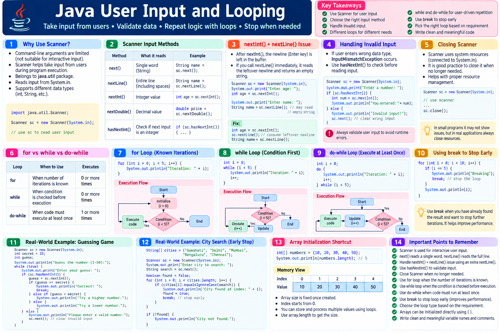

# Java Learning Journey — Day 19
## Interactive Input, `while` / `do-while`, and Efficient Loop Control

Today’s session connected several earlier concepts into a more practical programming workflow:

```text
Command-line arguments
        ↓
Limitation of fixed input
        ↓
Interactive console input
        ↓
Scanner
        ↓
Input validation
        ↓
while / do-while
        ↓
Choosing the right loop
        ↓
break when the required result is already found
        ↓
Think about performance, not only output
```

---

# 1. Revisiting Command-Line Arguments

The session began by revisiting command-line arguments.

They allow an application to receive input when the program starts.

Conceptually:

```text
User
  ↓
Command-line arguments
  ↓
Application
  ↓
Program processes input
```

The limitation discussed was that command-line arguments are **not interactive**.

All required input has to be supplied at the time the program is launched.

If one of the inputs is wrong or missing, the user needs to run the program again with the required arguments.

This becomes inconvenient when an application needs to guide the user through input step by step.

---

# 2. Why Interactive Input Is Needed

The session used a form-like example.

Imagine a program asking for:

```text
First name
Email
Age
```

If the user enters the wrong kind of information, an interactive program can respond and ask for the required input.

The key difference is:

### Command-line arguments

```text
Give input
    ↓
Program starts
    ↓
Program processes it
```

### Interactive input

```text
Program starts
    ↓
Ask for input
    ↓
User responds
    ↓
Program continues
    ↓
Ask for next input
```

This makes the program interactive.

---

# 3. `Scanner`

To read interactive input from the console, the session introduced Java's:

```java
Scanner
```

class.

`Scanner` belongs to:

```java
java.util
```

Therefore, it needs to be imported when used.

```java
import java.util.Scanner;
```

The session also revisited an earlier Eclipse shortcut:

```text
Ctrl + Shift + T
```

can be used to search for a Java class by name.

`Scanner` can also be found through Eclipse content assistance.

---

# 4. `java.lang` vs `java.util`

An important package point was revisited:

```text
java.lang
```

is automatically imported.

Other packages, such as:

```text
java.util
```

need to be imported when their classes are used.

Therefore:

```java
Scanner
```

requires an import from `java.util`.

---

# 5. Creating a `Scanner`

The session demonstrated creating a `Scanner` object using:

```java
Scanner sc = new Scanner(System.in);
```

The important idea was:

```text
Scanner object
      ↓
System.in
      ↓
Console input
```

`System.in` represents the standard input stream.

The Scanner uses that input source to read what the user types.

---

# 6. `System.in`

The session explained `System.in` as the source through which input is supplied to the program.

For normal console interaction:

```java
System.in
```

is connected to standard input, typically the keyboard/console input.

So:

```java
Scanner sc = new Scanner(System.in);
```

means the Scanner is configured to read from that input source.

The broader idea is important:

> When a program reads data, the developer needs to know where that data is coming from.

The session briefly noted that input can also come from a file by using an appropriate Scanner constructor.

---

# 7. Reading a String

The session demonstrated:

```java
sc.nextLine();
```

for reading a line of String input.

For example:

```java
String name = sc.nextLine();
```

The flow is:

```text
User types input
      ↓
Console
      ↓
System.in
      ↓
Scanner
      ↓
nextLine()
      ↓
String variable
```

---

# 8. Reading an Integer

For integer input, the session demonstrated:

```java
sc.nextInt();
```

For example:

```java
int price = sc.nextInt();
```

The Scanner provides data-type-specific methods.

Examples mentioned in the session included methods for:

- `int`
- `boolean`
- `float`

and other supported data types.

---

# 9. `next()` vs `nextLine()`

The session briefly distinguished the Scanner methods.

```java
next()
```

reads the next token.

```java
nextLine()
```

reads the next line of input.

The session also demonstrated:

```java
next()
```

in the context of consuming a single token/character-sized input.

The important point for today's learning is that Scanner provides different methods depending on how input should be consumed.

---

# 10. The `nextInt()` + `nextLine()` Issue

One of the practical problems demonstrated was:

```java
int price = sc.nextInt();
String address = sc.nextLine();
```

The user may expect `address` to wait for a new line of text, but it may appear to be skipped.

Why?

After `nextInt()` reads the integer, the newline entered after the integer remains in the input.

Then:

```java
nextLine()
```

consumes that remaining newline.

So the String may appear empty.

---

# 11. Consuming the Extra Newline

The session demonstrated consuming the remaining newline before reading the actual line.

Conceptually:

```java
int price = sc.nextInt();

sc.nextLine();  // consume remaining newline

String address = sc.nextLine();
```

The important lesson is:

```text
nextInt()
   ↓
integer consumed
   ↓
newline remains
   ↓
nextLine() consumes newline
   ↓
nextLine() reads actual String line
```

This issue was specifically discussed as a practical Scanner behavior to understand.

---

# 12. Input Mismatch

The session demonstrated what happens when the program expects an integer but the user supplies non-integer input.

For example:

```java
int price = sc.nextInt();
```

If the user enters something that is not an integer, Scanner can produce:

```text
InputMismatchException
```

The important point was not exception handling itself, but recognizing that the input type supplied by the user may not match the data type expected by the program.

---

# 13. Validating Input Before Consuming It

The session introduced Scanner's validation methods.

For example:

```java
sc.hasNextInt()
```

checks whether the next input can be interpreted as an integer.

Conceptually:

```text
User input
    ↓
hasNextInt()
    ↓
 ┌───────────────┐
 │               │
true           false
 │               │
 ↓               ↓
nextInt()      ask again /
read value     show message
```

The session's example used this idea to make sure the user supplies a valid integer before attempting:

```java
nextInt()
```

---

# 14. Input Validation Pattern

The practical pattern introduced was:

```java
if (sc.hasNextInt()) {
    int price = sc.nextInt();
} else {
    System.out.println("Please enter the price in correct format");
}
```

The important sequence is:

```text
Validate
   ↓
Consume
```

rather than immediately trying to consume input that may have the wrong type.

---

# 15. Why Validation Matters

Suppose the requirement is:

> Enter a price.

The program expects a number.

If the user enters:

```text
one lakh
```

the program cannot treat that input as an integer.

Instead of blindly consuming it as an integer, the application can first validate the input.

This is a basic step toward building programs that respond to incorrect user input.

---

# 16. Closing the Scanner

The session connected input handling with the broader software principle:

> If you open a connection/resource, you should close it when the work is finished.

The Scanner was described as creating a connection with the console/input source.

After the input work is complete, the Scanner can be closed:

```java
sc.close();
```

The session used a real-world analogy:

```text
Open a door
   ↓
Use it
   ↓
Close the door
```

The same general idea applies to software resources.

---

# 17. Why Leaving Resources Open Matters

The session connected an open connection with an object remaining active.

The broader point was:

```text
Create resource/object
       ↓
Use it
       ↓
Work finished
       ↓
Close/release it
```

Keeping resources unnecessarily active can consume resources.

The session used a large-scale application example to explain why developers should not casually leave connections/resources open.

---

# 18. Garbage Collection Connection

The session briefly connected resource lifetime with garbage collection.

The key concept discussed was:

> Garbage collection deals with objects that are no longer reachable/usable by the application.

The session used the idea of an object being referenced versus becoming unused.

A reference being set to `null` was discussed as one way an object can become eligible for garbage collection when no other references keep it reachable.

However, an important distinction is:

```text
Closing a resource
```

and:

```text
Garbage collection
```

are not the same operation.

Closing a Scanner/resource is an explicit resource-management action.

Garbage collection is JVM-managed memory cleanup.

---

# 19. Choosing Between `for` and `while`

The session revisited the reason for choosing different loop types.

### `for`

Use when the number of iterations or input size is known/fixed.

Example:

```text
2,000 customers
2,000 orders
10,000 orders
```

If the entire collection must be processed, there is a known maximum number of iterations.

Conceptually:

```text
Known input size
       ↓
Known maximum iterations
       ↓
for loop
```

---

# 20. `while`

The session introduced `while` for situations where the number of iterations is **not known in advance**.

The example was a process where one person keeps writing data and another process keeps reading it.

The reader does not know beforehand whether there will be:

```text
100 lines
5,000 lines
or another number
```

Therefore:

```text
Unknown number of iterations
        ↓
while loop
```

The key distinction is not that one loop can technically replace another.

It is about choosing the structure that best represents the requirement.

---

# 21. `while` Syntax

The basic syntax introduced was:

```java
while (condition) {
    // business logic
}
```

The condition is checked before the body executes.

Therefore:

```text
Check condition
      ↓
true?
  ↓
execute body
  ↓
check again
  ↓
...
```

The loop continues while the condition remains true.

---

# 22. `while` Can Execute Zero Times

Because the condition is checked first, a `while` loop may execute **zero times**.

Conceptually:

```text
while (false) {
    // this does not execute
}
```

The session contrasted this behavior with `do-while`.

---

# 23. Example: Counter with `while`

The session used a simple counter example similar to:

```java
int number = 0;
int max = 10;

while (number < max) {
    System.out.println(number);
    number++;
}
```

The important execution flow is:

```text
number = 0
    ↓
check number < max
    ↓
true
    ↓
print number
    ↓
number++
    ↓
check again
```

The counter makes the condition dynamic.

---

# 24. Why the Counter Must Change

Consider:

```java
int number = 0;

while (number < 10) {
    System.out.println(number);
}
```

The condition never changes because `number` never changes.

The session emphasized updating the variable:

```java
number++;
```

so that the condition can eventually become false.

The broader idea is:

```text
Condition
   ↓
must eventually change
   ↓
loop can terminate
```

---

# 25. Real Use Case for `while`

The strongest example introduced was a guessing game.

The program has a hidden/lucky number.

The user repeatedly enters guesses.

The program does not know how many attempts the user will need.

Therefore:

```text
User guesses
    ↓
Correct?
 ┌──┴──┐
Yes    No
 ↓      ↓
Stop   Ask again
```

This is a natural `while`-loop use case.

---

# 26. Guessing-Game Flow

The conceptual logic was:

```text
Lucky number exists
       ↓
User enters a number
       ↓
Is it the lucky number?
       ↓
 ┌─────┴─────┐
Yes          No
 ↓            ↓
Success     Try again
              ↓
        User enters again
```

The number of attempts depends on the user.

That is why the total number of iterations is not known before the program begins.

---

# 27. `while` + `Scanner`

The guessing example also connected the two topics:

```text
Scanner
  ↓
Read user input
  ↓
while condition
  ↓
Check guess
  ↓
Correct → finish
Wrong → ask again
```

This is a practical example of why interactive input and `while` loops naturally work together.

---

# 28. `while` vs `for`

The session's fundamental comparison was:

| Situation | Suitable loop |
|---|---|
| Number of iterations/input size known | `for` |
| Number of iterations not known in advance | `while` |

Example:

```text
Process 10,000 known orders
→ for
```

versus:

```text
Keep asking until the user guesses correctly
→ while
```

---

# 29. `do-while`

The third loop discussed was:

```java
do {
    // business logic
} while (condition);
```

The key difference from `while` is **when the condition is checked**.

### `while`

```text
Check condition
      ↓
Execute if true
```

### `do-while`

```text
Execute first
      ↓
Check condition
      ↓
Repeat if true
```

---

# 30. `do-while` Executes at Least Once

This is the defining behavior introduced in the session.

Even if the condition is initially false:

```java
do {
    // code
} while (false);
```

the body executes once.

Why?

Because the condition is checked **after** the first execution.

---

# 31. `while` vs `do-while`

A useful mental model:

```text
while
─────
Condition?
   ↓
false → 0 executions
true  → execute


do-while
─────────
Execute
   ↓
Condition?
   ↓
true  → execute again
false → stop
```

This difference determines when each loop is appropriate.

---

# 32. Practical `do-while` Example

The session related `do-while` to an interface such as an ATM screen.

The user needs to see the initial screen before the application can evaluate whether another interaction should happen.

This is the type of situation where:

```text
Execute once
     ↓
Then decide whether to continue
```

can be useful.

---

# 33. Loop Selection Mental Model

Today's three-loop model can be remembered as:

```text
Do I know the number of iterations?
        │
     ┌──┴──┐
    Yes    No
     │      │
    for   while
            │
            │
   Need the body to run
      at least once?
            │
          Yes
            ↓
        do-while
```

This is a conceptual selection guide rather than a strict rule that one loop can never be used instead of another.

---

# 34. `break`

The session then introduced:

```java
break;
```

`break` is used when the required work has already been completed and there is no reason to continue the loop.

The key meaning:

> **Exit the loop immediately.**

---

# 35. City Search Example

The practical example was:

```text
A large array/list of cities
        ↓
Find whether Bangalore exists
```

Suppose there are:

```text
100,000 cities
```

and Bangalore is found at position `300`.

If the requirement is only:

> Does Bangalore exist?

then continuing to inspect the remaining 99,700 entries is unnecessary.

Once Bangalore is found:

```java
break;
```

can terminate the loop.

---

# 36. Why `break` Improves the Search

Without `break`:

```text
Search
 ↓
Bangalore found
 ↓
Continue searching
 ↓
Reach end
```

With `break`:

```text
Search
 ↓
Bangalore found
 ↓
break
 ↓
Exit loop
```

The second approach avoids unnecessary iterations after the required result has already been obtained.

This was presented as an example of thinking about **performance**, not merely getting the correct output.

---

# 37. Performance vs Output

One of the strongest lessons of the session was:

> **Do not focus only on whether the output is correct. Think about how the program gets that output.**

Two programs can produce the same answer while doing very different amounts of work.

For example:

```text
Find Bangalore
```

If Bangalore is found early, continuing through the entire list wastes work when the requirement is only existence.

So the developer should ask:

```text
Can I stop?
Have I already achieved the requirement?
Am I doing unnecessary work?
```

---

# 38. `break` as Requirement-Driven Control

The important reasoning pattern is:

```text
Requirement:
"Find whether Bangalore exists."

        ↓

Check each element

        ↓

Bangalore found?

        ↓ Yes

Requirement satisfied

        ↓

break

        ↓

Exit loop
```

`break` should therefore be tied to a meaningful completion condition, not added randomly.

---

# 39. Array Initialization Shortcut

The session also demonstrated another way of creating an array.

Instead of:

```java
String[] cities = new String[3];

cities[0] = "Bangalore";
cities[1] = "Mumbai";
cities[2] = "Chennai";
```

Java allows initialization with values:

```java
String[] cities = {
    "Bangalore",
    "Mumbai",
    "Chennai"
};
```

The session described this as another way of creating an array.

---

# 40. Efficient City Search

The complete thought process became:

```text
City array
    ↓
Known/fixed input size
    ↓
Use for loop
    ↓
Read current city
    ↓
Compare with "Bangalore"
    ↓
Found?
 ┌──┴──┐
Yes   No
 ↓     ↓
break continue
```

The key improvement is stopping when the required answer has already been found.

---

# 41. Duplicate Values

The city example also considered duplicates.

A city might appear more than once in the data.

For an existence check, that does not change the requirement.

The first matching occurrence is enough:

```text
Bangalore found once
      ↓
Existence confirmed
      ↓
break
```

There is no need to count all occurrences when the requirement only asks whether the city exists.

---

# 42. Different Requirement, Different Loop Logic

This is an important distinction.

### Requirement A

> Does Bangalore exist?

First match is enough:

```java
break;
```

### Requirement B

> How many Bangalore orders exist?

You cannot stop at the first match.

You need to continue processing the remaining data and count matches.

Therefore:

```text
Business requirement
       ↓
Determines loop behavior
```

---

# 43. Professional Thinking About Loops

Before writing a loop, ask:

```text
1. What am I processing?
2. Do I know the input size?
3. Do I know the maximum/expected iterations?
4. Does the loop need to run at least once?
5. What condition ends the loop?
6. Can the required result be reached before the end?
7. If yes, can `break` avoid unnecessary work?
```

This turns loop selection into a reasoning process instead of syntax memorization.

---

# 44. Common Mistakes

### Mistake 1 — Using command-line arguments for interactive workflows

Command-line arguments require input when the program starts and do not provide the interactive prompt-based flow demonstrated with Scanner.

### Mistake 2 — Forgetting the `java.util` import

`Scanner` is not in `java.lang`.

### Mistake 3 — Calling `nextLine()` immediately after `nextInt()`

The leftover newline can be consumed unexpectedly.

### Mistake 4 — Reading an integer without considering input type

A non-integer input can result in `InputMismatchException`.

### Mistake 5 — Not validating before reading

Use:

```java
hasNextInt()
```

when you need to check whether the next input is an integer.

### Mistake 6 — Forgetting to close the Scanner/resource

If a resource is opened/created for use, consider its appropriate closing/release action when finished.

### Mistake 7 — Choosing `while` simply because it can reproduce a `for` loop

The session emphasized choosing the loop according to the requirement.

### Mistake 8 — Forgetting to change the `while` condition's controlling value

The loop may never terminate if the condition never changes.

### Mistake 9 — Continuing after the required result is already found

If the requirement is satisfied early, consider whether `break` can avoid unnecessary iterations.

---

# 45. What I Learned Today

The main concepts covered were:

- Limitations of command-line arguments
- Interactive console input
- `Scanner`
- `java.util`
- `System.in`
- Creating a Scanner object
- `nextLine()`
- `next()`
- `nextInt()`
- Input type mismatch
- `InputMismatchException`
- `hasNextInt()`
- Input validation
- Consuming the newline after `nextInt()`
- Closing Scanner
- Resource/connection lifetime
- Garbage collection connection
- `for` vs `while`
- `while` syntax
- Condition-first execution
- `while` may execute zero times
- Dynamic loop condition
- User-driven iteration
- Guessing-game use case
- `do-while`
- Execute-first, condition-later behavior
- `do-while` executes at least once
- `break`
- Early termination
- Performance thinking
- Array initialization with values
- Efficient city search
- Duplicate values
- Requirement-driven loop design

---

# 46. Final Mental Model

```text
INPUT
 │
 ├── Known at program start
 │       ↓
 │   Command-line arguments
 │
 └── Interactive
         ↓
       Scanner
         ↓
     Validate input
         ↓
       Consume input


LOOP SELECTION
 │
 ├── Known iteration/input size
 │       ↓
 │      for
 │
 ├── Unknown iterations
 │       ↓
 │     while
 │
 └── Must execute at least once
         ↓
      do-while


LOOP OPTIMIZATION
 │
 ├── Requirement already satisfied
 │       ↓
 │     break
 │
 └── Otherwise
         ↓
   Continue processing
```

---
## Visual Note



---

# 47. Session Boundary

The material in this document intentionally stays within what was demonstrated or explained during the session.

### Covered

- Interactive console input
- Scanner
- `System.in`
- Scanner input methods
- Input validation
- `nextInt()` / `nextLine()` newline behavior
- `for`
- `while`
- `do-while`
- Loop selection
- `break`
- Array search
- Performance-oriented reasoning
- Resource closing
- Introductory garbage-collection connection

### Not Expanded Beyond the Session

- Exception-handling implementation
- Advanced resource management
- `try-with-resources`
- Collections
- Enhanced `for`
- `continue`
- Nested loops
- Advanced algorithm analysis
- Advanced garbage-collection internals

---

## One-Line Takeaway

**Choose the loop based on the requirement, validate interactive input before consuming it, and stop processing when the required result has already been achieved.**
