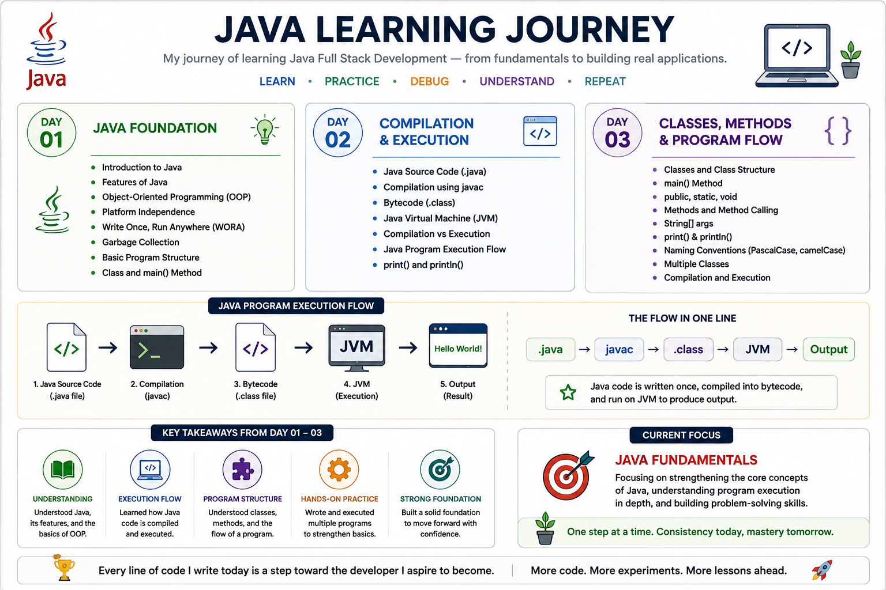
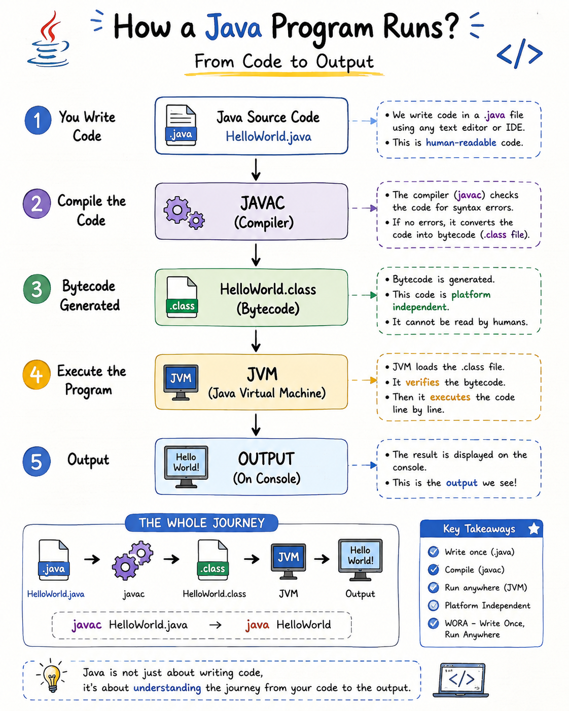

# Java Learning Journey

My journey of learning Java Full Stack Development — from fundamentals to building real applications.

This repository is where I document what I learn, practice the concepts, and keep the code I write along the way.

---

## What I'm Learning

- Java Fundamentals
- Object-Oriented Programming
- Collections
- Exception Handling
- SQL & Databases
- JDBC
- Backend Development
- APIs
- Projects

---

## Learning Approach

I am focusing on understanding concepts rather than simply memorizing syntax.

```text
Learn → Practice → Debug → Understand → Repeat
```

Each learning session is documented with notes, classroom examples, and practice programs so the repository reflects my progress as I build my Java foundation.

---

## Progress

| Stage | Status |
|---|---|
| Java Fundamentals | 🔄 In Progress |
| Java OOP | ⏳ Upcoming |
| Collections | ⏳ Upcoming |
| Database & JDBC | ⏳ Upcoming |
| Backend Development | ⏳ Upcoming |
| Projects | ⏳ Upcoming |

---

## Learning Log

| Days | Focus | Notes |
|---|---|---|
| [Day 01](Day-01/README.md) | Java Foundation | Introduction to Java, Java features, platform independence, WORA, garbage collection, class structure and the `main()` method |
| [Day 02](Day-02/README.md) | Compilation, Bytecode & JVM | Java source code, compilation, bytecode, `.class` files, JVM, execution flow, `print()` and `println()` |
| [Day 03](Day-03/README.md) | Classes, Methods & Program Flow | Classes, methods, `public`, `static`, `void`, `String[] args`, naming conventions, multiple classes and basic program flow |
| [Day 01–03](Day-01-03-Overview.md) | Combined Overview | Consolidated notes from the first three Java learning sessions |

---

## Practice

The repository includes classroom-based Java examples and simple practice exercises alongside the learning notes.

### Day 03 Practice

- `examples/` — Java examples from the learning session
- `exercises/` — additional practice programs based on the topics covered

The focus is on writing, compiling, running, reading errors, and repeating programs until the basic Java structure becomes familiar.

---

## Visual Notes

### Day 01–03 Learning Overview



### Java Program Execution



> `.java → javac → .class → JVM → Output`

---

## Current Focus

### Java Fundamentals

Starting with the basics, understanding how Java code is structured, compiled and executed, and building a strong foundation for backend development.

The immediate goal is simple: **understand the fundamentals well before moving to the next layer.**

---

## Repository Structure

```text
Java-Learning-Journey/
│
├── Day-01/
├── Day-02/
├── Day-03/
│   ├── examples/
│   ├── exercises/
│   └── README.md
│
├── assets/
├── Day-01-02-Overview.md
├── Day-01-03-Overview.md
└── README.md
```

---

## What's Next

Continue building the Java foundation session by session, keeping the learning process practical, documented, and consistent.

**More code, more experiments, more lessons ahead.**
