# Java Learning Journey

My journey of learning Java Full Stack Development — from fundamentals to building real applications, with my current learning focus on Java Backend Development.

This repository is where I document what I learn, practice the concepts, and keep the code I write along the way.

---

## What I'm Learning

- Java Fundamentals
- Object-Oriented Programming
- Methods, Constructors & Object State
- Access Modifiers & Packages
- Eclipse IDE & Debugging
- Core Java APIs
- Collections
- Exception Handling
- SQL & Databases
- JDBC
- Backend Development
- APIs
- Projects

---

## Learning Approach

I am focusing on understanding concepts rather than simply memorizing syntax.

```text
Learn → Practice → Debug → Understand → Repeat
```

Each learning session is documented with notes, classroom examples, and practice programs so the repository reflects my progress as I build my Java foundation.

---

## Progress

| Stage | Status |
|---|---|
| Java Fundamentals | 🔄 In Progress |
| Java OOP | 🔄 In Progress |
| Collections | ⏳ Upcoming |
| Database & JDBC | ⏳ Upcoming |
| Backend Development | ⏳ Upcoming |
| Projects | ⏳ Upcoming |

### Current Position

**Day 15 — Constructor Chaining, `this()`, `super()` & Introductory Logging**

The learning has progressed from Java program structure and command-line input into methods, access control, IDE-based development, object creation, constructors, runtime state, and constructor chaining across inheritance.

---

## Learning Log

| Days | Focus | Notes |
|---|---|---|
| [Day 01](Day-01/README.md) | Java Foundation | Introduction to Java, Java features, platform independence, WORA, garbage collection, class structure and the `main()` method |
| [Day 02](Day-02/README.md) | Compilation, Bytecode & JVM | Java source code, compilation, bytecode, `.class` files, JVM, execution flow, `print()` and `println()` |
| [Day 03](Day-03/README.md) | Classes, Methods & Program Flow | Classes, methods, `public`, `static`, `void`, `String[] args`, naming conventions, multiple classes and basic program flow |
| [Day 04](Day-04/README.md) | Command-Line Arguments | Hardcoding, dynamic input, command-line arguments, `String[] args`, array indexing, Program Arguments vs JVM Arguments, and Java execution |
| [Day 05](Day-05/README.md) | String to Number Conversion & Java Runtime | `Integer.parseInt()`, String-to-int conversion, arithmetic with command-line input, JDK, JRE, JVM, JAR, decompilation, identifiers and reserved keywords |
| [Day 06–07](Day-06-07/README.md) | Data Types & Variables | Primitive data types, variables, default values, scope, local/instance/static variables, object vs class ownership, and basic JVM memory concepts |
| [Day 01–03](Day-01-03-Overview.md) | Combined Overview | Consolidated notes from the first three Java learning sessions |
| [Day 08](Day-08/) | Operators & Expressions | Assignment, arithmetic, comparison, logical, unary and ternary operators, short-circuit evaluation, and reading expressions to predict results |
| [Day 09](Day-09/) | Methods & Reusable Logic | Methods, parameters, arguments, return type, return value, `return`, static method calls, built-in vs user-defined methods, meaningful naming, and introductory Single Responsibility |
| [Day 10](Day-10/) | Access Modifiers, Packages & Access Rules | `private`, default/package-private, `protected`, `public`, packages, imports, `this`, multi-class structure, and reading compilation/access errors |
| [Day 11](Day-11/) | Eclipse IDE & Developer Workflow | Java projects, packages, classes, automatic compilation, errors vs warnings, Content Assist, `sysout`, formatting, imports, breakpoints, and step-by-step debugging |
| [Day 12](Day-12/) | Objects, Constructors & Runtime State | Class vs object, object creation, constructors, parameters and arguments, `this`, multiple objects, debugger inspection, Program Arguments vs VM Arguments, introductory heap-dump purpose, and GitHub workflow |
| [Day 13](Day-13/) | Constructors in Depth | Constructor matching, argument type/order, multiple constructors, constructor overloading, no-argument constructor rule, object state, `this`, constructor access, and requirement-driven constructor design |
| [Day 14](Day-14/) | Runtime Object State & Debugging | Instance vs static variables, `static` vs `final`, class loading, static initialization, `Object` hierarchy, meaningful breakpoints, F5/F6/F7/F8, driver/service structure, and runtime-state investigation |
| [Day 15](Day-15/) | Constructor Chaining & Logging | Application logging concepts, `this()`, `super()`, first-statement rule, implicit `super()`, constructor matching across inheritance, parent-before-child initialization, three-level constructor chains, and compiler-error reasoning |

---

## Practice

The repository includes classroom-based Java examples and simple practice exercises alongside the learning notes.

### Day 03–07 Practice

Each learning day includes practice material based on the concepts covered in that session.

- `PRACTICE-QUESTIONS.md` — short questions and coding practice for revision
- `Exercises/` — additional Java programs written independently
- Classroom `.java` files — programs worked through during the learning session

The focus is on writing, compiling, running, reading errors, and repeating programs until the concepts become familiar.

### Current Practice Focus

- **Day 04:** Command-line arguments and dynamic input
- **Day 05:** String-to-number conversion using `Integer.parseInt()` and basic Java runtime concepts
- **Day 06–07:** Primitive data types, variables, scope, default values, and Local vs Instance vs Static variables
- **Day 08:** Reading and evaluating operator expressions, including short-circuit and ternary logic
- **Day 09:** Method anatomy, parameter/argument matching, return flow, reusable logic, and meaningful naming
- **Day 10:** Access-control reasoning, package boundaries, `import` vs permission, multi-class structure, and compiler errors
- **Day 11:** Eclipse project structure, Content Assist, automatic compilation, errors/warnings, breakpoints, and basic debugging
- **Day 12:** Class vs object, constructor use, `this`, object-specific state, runtime inspection, Program Arguments vs VM Arguments, and Git workflow
- **Day 13:** Constructor selection, argument matching, constructor overloading, no-argument constructor rules, and object state
- **Day 14:** Static vs instance state, `static` vs `final`, class loading, breakpoints, F5/F6/F7/F8, and runtime flow
- **Day 15:** Logging concepts, `this()`, `super()`, constructor chaining, superclass initialization, and constructor-related compiler errors

---

## Recent Learning Progression

The learning path so far is connected rather than a collection of isolated topics:

```text
Java Foundation
      ↓
Compilation & JVM
      ↓
Classes, Methods & Program Flow
      ↓
Command-Line Arguments
      ↓
String → Number Conversion
      ↓
Data Types & Variables
      ↓
Operators & Expressions
      ↓
Methods & Reusable Logic
      ↓
Access Modifiers & Packages
      ↓
Eclipse IDE & Debugging
      ↓
Classes → Objects → Constructors
      ↓
Constructor Matching & Overloading
      ↓
Runtime Object State & Debugging
      ↓
this() / super() / Constructor Chaining
```

Each later topic is being connected back to earlier concepts: values are used by expressions, expressions feed methods, methods belong to classes, classes create objects, constructors initialize object state, and debugging is used to observe actual runtime behaviour.

---

## Key Concepts Reached So Far

### Java Execution

```text
.java
  ↓
javac
  ↓
.class bytecode
  ↓
java
  ↓
JVM
  ↓
Execution
```

### Command-Line Input

```text
Program Arguments
       ↓
String[] args
       ↓
String values
       ↓
Integer.parseInt() when numeric conversion is required
       ↓
Processing
```

### Variables & Ownership

```text
LOCAL
  ↓
Method / Block

INSTANCE
  ↓
Object

STATIC
  ↓
Class
```

### Access Control

```text
private   → same class
default   → same package
protected → same package + appropriate child-class access
public    → wider access when the type/member is accessible
```

`import` helps Java locate a type; it does not override the access modifier.

### Object & Constructor Flow

```text
Class
  ↓
new
  ↓
Object
  ↓
Matching Constructor
  ↓
Initialize Instance State
```

### Constructor Chaining

```text
new Child(...)
      ↓
Child constructor
      ↓
this(...) or super(...)
      ↓
Same-class or parent constructor
      ↓
Continue the chain
      ↓
Complete object initialization
```

### Debugging

```text
Breakpoint
    ↓
F5 — Step Into
F6 — Step Over
F7 — Step Return
F8 — Continue
    ↓
Inspect Runtime State
    ↓
Follow Actual Execution
```

---

## Developer Habits I'm Building

The repository is documenting development habits alongside Java concepts:

- Read the requirement before coding.
- Prefer meaningful names for classes, methods, variables, and parameters.
- Keep task-specific logic inside appropriate methods.
- Understand access restrictions instead of treating modifiers as syntax to memorize.
- Use the IDE to reduce repetitive work without becoming dependent on it.
- Place breakpoints at meaningful execution points.
- Read compiler errors to understand what Java is expecting.
- Practice both valid and intentionally invalid examples.
- Predict output and execution flow before relying on the debugger.
- Keep learning notes connected to actual code and experiments.

---

---

## Visual Notes

### Day 01–03 Learning Overview

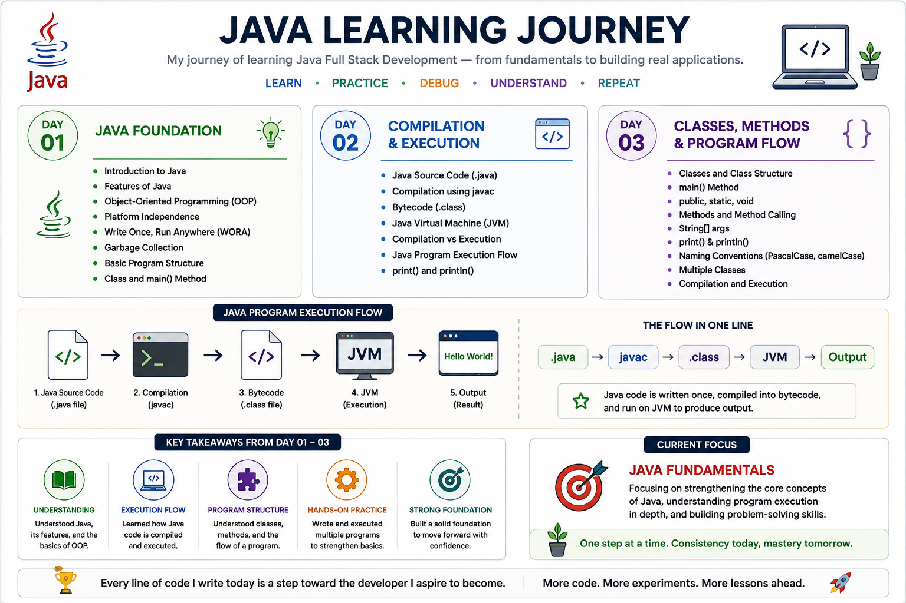

### Java Program Execution

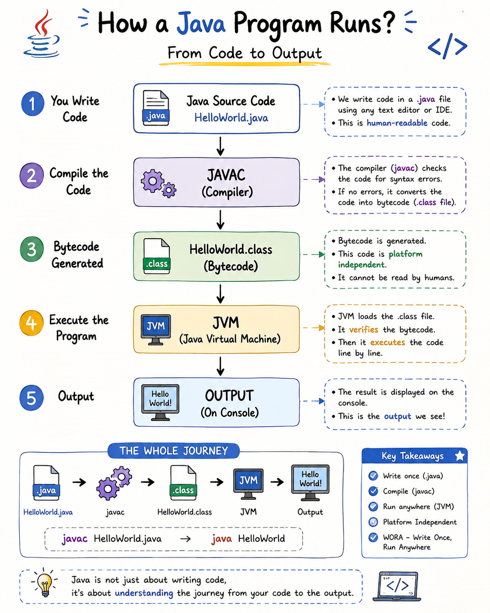

> `.java → javac → .class → JVM → Output`

### Day 04 — Command-Line Arguments

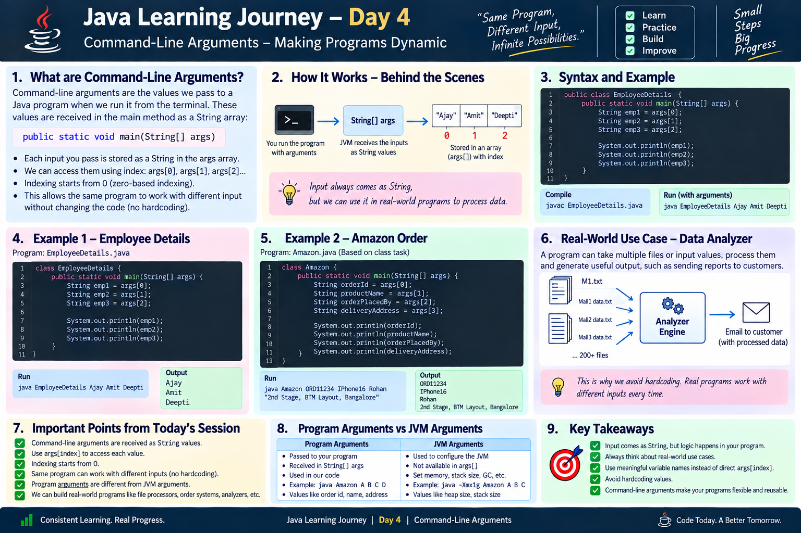

### Day 05 — From Strings to Numbers

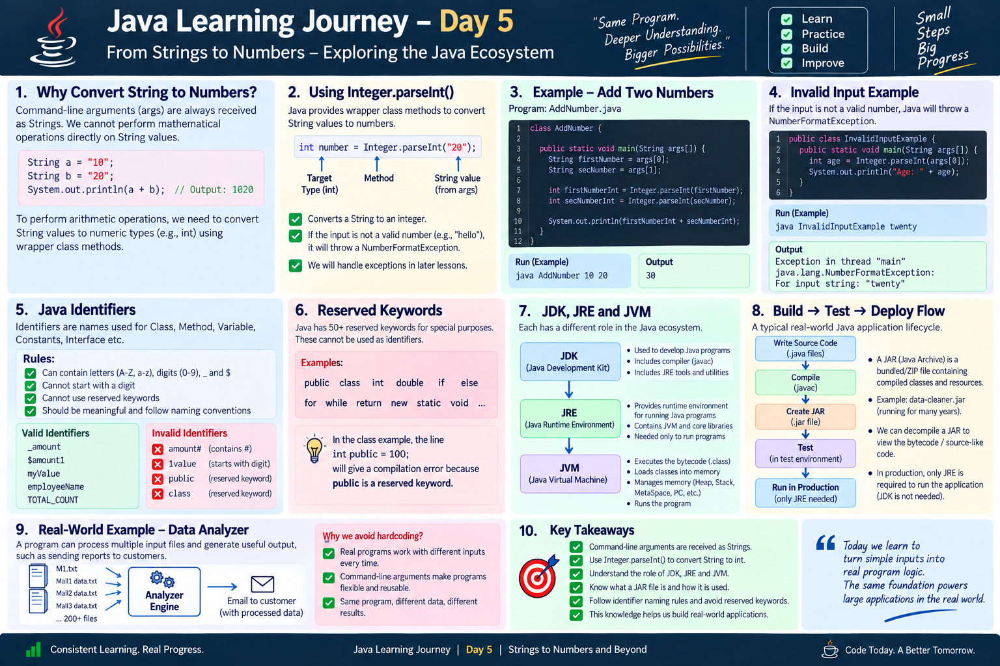

### Day 06–07 — Data Types & Variables

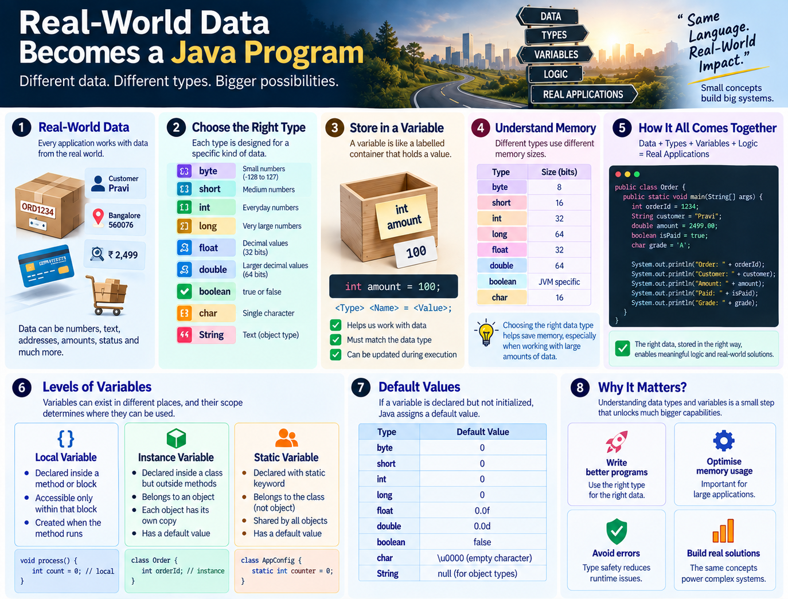

### Day 08 — Operators

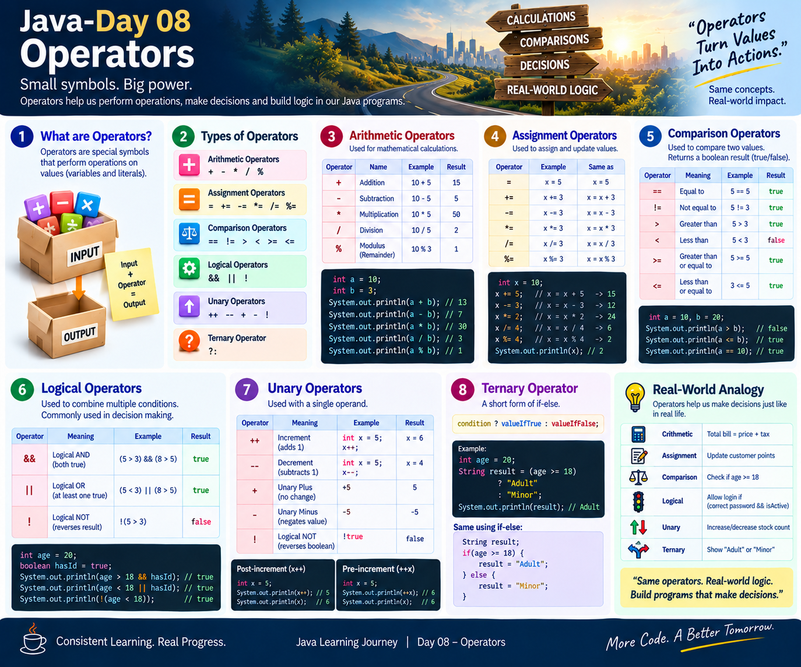

### Day 09 — Methods

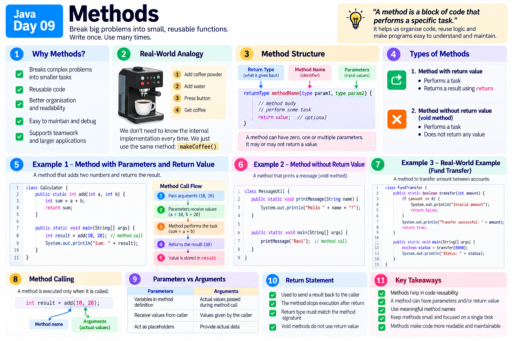

### Day 10 — Access Modifiers, Packages & Multiple Classes


### Day 11 — Writing Code to Working Like a Developer

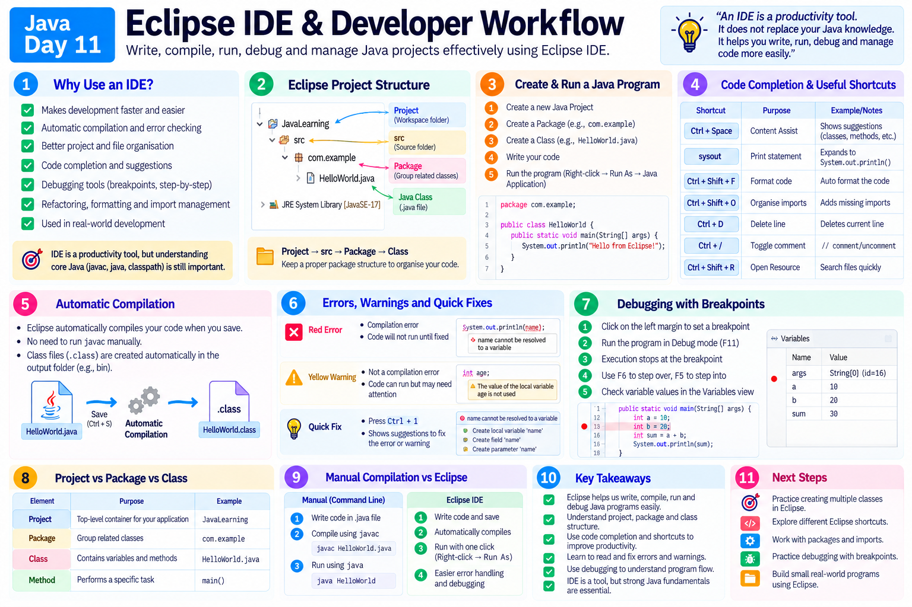

### Day 12 — Classes to Objects

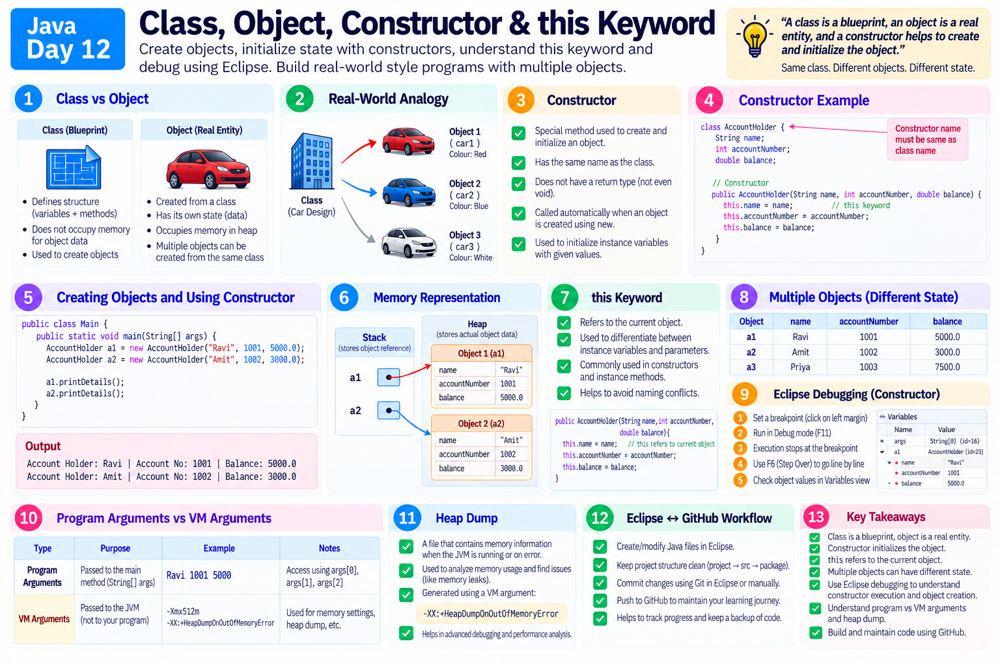

### Day 13 — Constructors

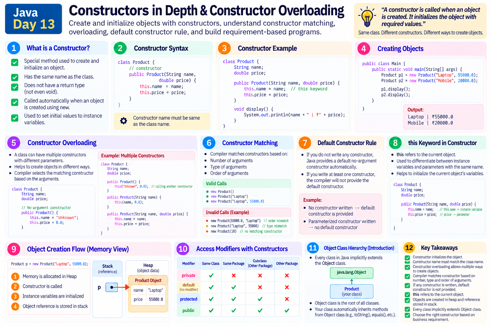

### Day 14 — Debugging Beyond the Code

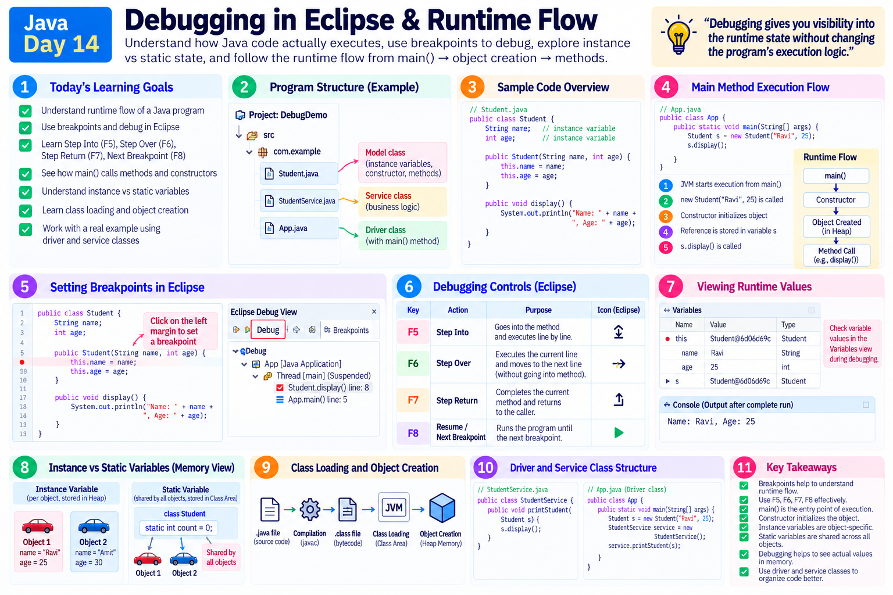

### Day 15 — Constructor Chaining

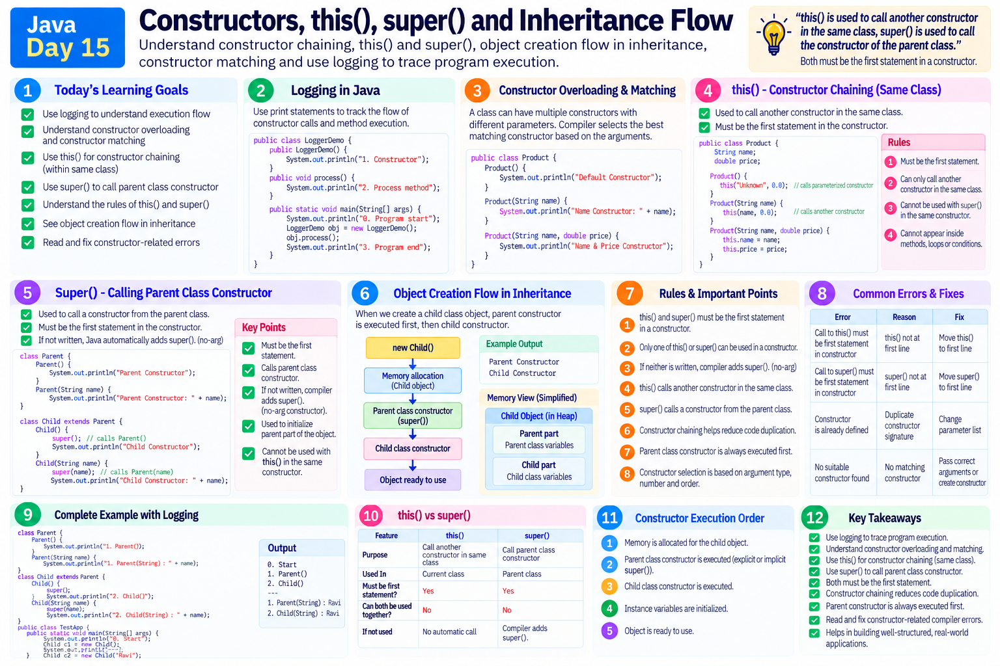

> The complete visual collection is maintained in the [`assets/`](assets/) folder.

---

## Current Focus

### Java Fundamentals → Object-Oriented Programming → Backend Foundations

Starting with the basics, understanding how Java code is structured, compiled and executed, and building a strong foundation for backend development.

The immediate goal remains the same: **understand the fundamentals well before moving to the next layer.**

The current focus has progressed into object creation and initialization:

```text
Class
  ↓
Object
  ↓
Constructor
  ↓
Instance State
  ↓
Method Call
  ↓
Runtime Behaviour
  ↓
Debugging
```

---

## Repository Structure

```text
Java-Learning-Journey/
│
├── Day-01/
├── Day-02/
├── Day-03/
│   ├── examples/
│   ├── exercises/
│   └── README.md
│
├── Day-04/
│   ├── Exercises/
│   ├── PRACTICE-QUESTIONS.md
│   └── README.md
│
├── Day-05/
│   ├── Exercises/
│   ├── PRACTICE-QUESTIONS.md
│   └── README.md
│
├── Day-06-07/
│   ├── Exercises/
│   ├── PRACTICE-QUESTIONS.md
│   ├── DataTypes.java
│   └── README.md
│
├── Day-08/
│   ├── PRACTICE-QUESTIONS.md
│   └── README.md
│
├── Day-09/
│   ├── PRACTICE-QUESTIONS.md
│   └── README.md
│
├── Day-10/
│   ├── PRACTICE-QUESTIONS.md
│   └── README.md
│
├── Day-11/
│   ├── PRACTICE-QUESTIONS.md
│   └── README.md
│
├── Day-12/
│   ├── PRACTICE-QUESTIONS.md
│   └── README.md
│
├── Day-13/
│   ├── PRACTICE-QUESTIONS.md
│   └── README.md
│
├── Day-14/
│   ├── PRACTICE-QUESTIONS.md
│   └── README.md
│
├── Day-15/
│   ├── PRACTICE-QUESTIONS.md
│   └── README.md
│
├── assets/
├── Day-01-02-Overview.md
├── Day-01-03-Overview.md
└── README.md
```

---

## Practice Repository Map

```text
Learning Session
       ↓
README.md
       ↓
PRACTICE-QUESTIONS.md
       ↓
Code / Experiments
       ↓
Predict → Compile → Run → Debug
       ↓
Document the lesson
```

The practice material has progressed from basic revision into medium, hard, and tricky reasoning around operators, methods, access control, Eclipse debugging, constructors, object state, and constructor chaining.

---

## What's Next

Continue building the Java foundation session by session, keeping the learning process practical, documented, and consistent.

The next sessions will build on this foundation with more Java language concepts and hands-on practice.

**More code, more experiments, more lessons ahead.**
